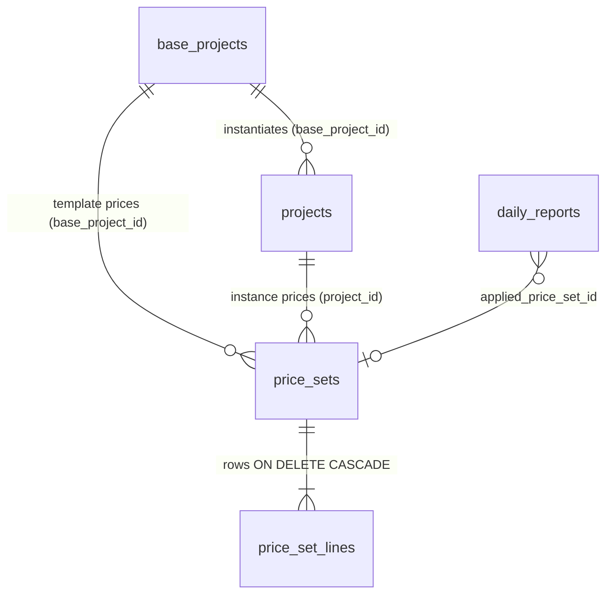
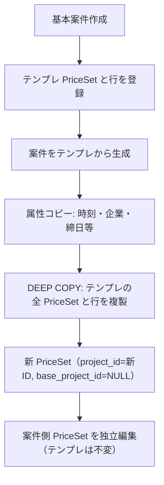

# 基本案件・個別案件・金額データのアーキテクチャ

> LinksSys の `ProjectTemplate` / `Project` / `PriceSet` / `PriceRow` 関係の正式仕様。実装は MariaDB 名で保持し、Prisma 名は対応表で示す。

---

## 1. ドメインエンティティ

| 概念 | Prisma | MariaDB | 役割 |
|------|--------|---------|------|
| 基本テンプレ | `ProjectTemplate` | `base_projects` | 繰り返し契約の型（既定勤務時間・休憩・締日・既定単価のひな形） |
| 個別案件 | `Project` | `projects` | 実行契約インスタンス（企業・パートナー・期間）。テンプレから生成または手動作成 |
| 金額マスタ | `PriceSet` | `price_sets` | 適用期間（`validFrom`〜`validTo`）付きの料金セット |
| 料金行 | `PriceRow` | `price_set_lines` | 曜日区分・計算区分ごとの請求／支払単価（現行は基本単価1列、将来4段拡張） |

---

## 2. ER 関係



- テンプレ用 `price_sets`: `base_project_id` のみ、`project_id` は NULL
- 案件用 `price_sets`: `project_id` のみ、`base_project_id` は NULL（ディープコピー後は **templateId を持たない**）

---

## 3. スキーマ対応（Prisma → MariaDB）

| Prisma | MariaDB |
|--------|---------|
| `templateId` | `projects.base_project_id` |
| `validFrom` / `validTo` | `apply_start_date` / `apply_end_date`（`validTo` NULL＝無期限） |
| `priceSetNo` | `price_sets.price_set_no`（例 `PS-20260801-001`） |
| `dayType` | `price_set_lines.weekday_code`（`day_type` マスタ: weekday=平日, half=半日, sat=土曜…） |
| `calcType` | `price_set_lines.calc_type_code`（`daily` / `hourly`） |
| `billingPrice1` | `billing_unit_price`（将来 `billing_price_2`〜4 は次段） |
| `paymentPrice1` | `payment_unit_price` |

`PriceCategory` は現行 `price_type_code`（基本・残業・深夜等）で代替。

---

## 4. ライフサイクル・ディープコピー



### 4.1 ディープコピー不変条件（必須）

- テンプレから `Project` を生成するとき、テンプレに紐づく **すべての `PriceSet` と `PriceRow` を複製**する。
- **理由**: 単価の隔離。テンプレ改定が既存・過去の契約単価を変えない。

### 4.2 適用期間（validFrom / validTo）

- 1 案件（または 1 テンプレ）に **複数 `PriceSet`** を持てる。改定時は **上書きせず** `validFrom = 改定日` の **新規 PriceSet** を追加する。
- **validFrom は必須**。同一 owner で期間重複は API が拒否する。

### 4.3 削除

| 操作 | 挙動 |
|------|------|
| 基本案件論理削除 | 当該テンプレの `price_sets` と行のみ論理削除。**既存個別案件の PriceSet は残す** |
| 個別案件論理削除 | 当該 `project_id` の `price_sets` と行を論理削除 |
| 物理削除（DB） | `price_set_lines` は FK `ON DELETE CASCADE`（`011` マイグレーション） |

---

## 5. 単価解決・計算アルゴリズム

### 5.1 日報日付での PriceSet 選択

`entry.date >= validFrom && (validTo == null || entry.date <= validTo)`

複数ヒット時は **開始日が新しい** セットを優先（最小仮組）。

### 5.2 曜日区分フォールバック（厳密順）

```text
平日(weekday) → 半日(half) → 土曜(sat) → 日曜(sun) → 祝日(holiday) → その他(other)
→ 互換: all, mon〜fri
```

実装: `backend/src/services/price_calc.js` の `resolvePriceRow`

各行について:

1. 対象曜日 + 計算区分（daily）の完全一致
2. 対象曜日 + 計算区分任意
3. 上記フォールバック順で daily → hourly

### 5.3 計算優先順位

1. **スポット上書き**（`spot_amount` / 将来 `useSpotPrice`）: PriceSet 参照をスキップ
2. **不足時間控除**: 実働 &lt; 標準 net 勤務のとき `実働 × 時間単価`（`日極 / (拘束−休憩)`）
3. 通常: PriceSet 行の基本請求／支払単価

日報保存時 `applied_price_set_id` を記録。

---

## 6. 実装チェックリスト

| 項目 | 状態 |
|------|------|
| 期間重複バリデーション | 実装済（`validateNoOverlappingPeriods`） |
| ディープコピー | 実装済（`deepCopyPriceSetsFromBaseToProject`） |
| validFrom 必須 | 実装済（`assertValidFromRequired`） |
| PriceSet 採番 `PS-YYYYMMDD-001` | 実装済（`allocatePriceSetNo`） |
| 行 CASCADE（物理削除） | 実装済（`011`） |
| Project 採番 `PRJ-0001` | 未実装（次段） |
| PriceRow 4段単価列 | 未実装（`extra_data` または列追加は次段） |
| 祝日マスタ連動 | 未実装（次段） |
| 行ソート（DayType マスタ順） | `sort_order` + `day_type` マスタ（部分） |

---

## 7. UI・画面

画面操作の詳細は **`個別機能仕様書：1-3. 案件マスタ管理画面.md`**。

- 基本／個別詳細に **金額データ** セクション（複数 PriceSet・期間）
- `price_set_id` 単一 FK セレクトは使用しない
- 金額データ管理から `base_project_id` / `project_id` で深リンク

## 8. レガシー

- `project_revisions`: 参照のみ。金額の正は `project_id` 紐づき PriceSet
- `projects.price_set_id` / `base_projects.price_set_id`: 後方互換列（画面・計算では未使用）

---

*LinksSys Project & Price Specification（MariaDB 版）— 2026-08-01*
