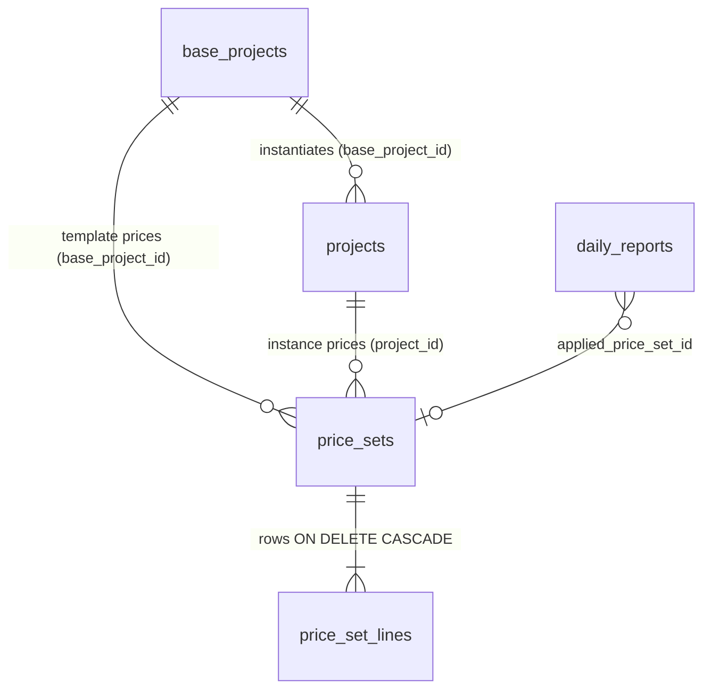
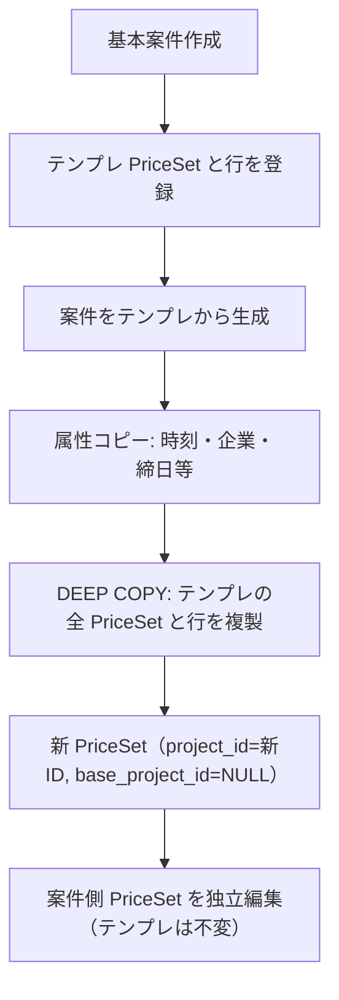

# 基本案件・個別案件・金額データのアーキテクチャ

> **2026-09-05 追記**: 各料金項目は請求摘要グループ名と支払摘要グループ名を持ち、相手先・案件・料金名の変数を展開できる。摘要明細は日付料金、時間料金の順で、基本、時間超過、深夜、深夜時間外、その他、不足時間を初期順とし、共通設定で変更可能とする。金額データ画面は料金名称・曜日・摘要名と請求／支払／利益率マトリクスを一体表示する。

> LinksSys の `ProjectTemplate` / `Project` / `PriceSet` / `PriceRow` 関係の正式仕様。実装は MariaDB 名で保持し、Prisma 名は対応表で示す。

---

## 1. ドメインエンティティ

| 概念 | Prisma | MariaDB | 役割 |
|------|--------|---------|------|
| 基本テンプレ | `ProjectTemplate` | `base_projects` | 繰り返し契約の型（既定勤務時間・休憩・締日・既定単価のひな形） |
| 個別案件 | `Project` | `projects` | 実行契約インスタンス（企業・パートナー・期間）。テンプレから生成または手動作成 |
| 金額マスタ | `PriceSet` | `price_sets` | 適用期間（`validFrom`〜`validTo`）付きの料金セット |
| 料金行 | `PriceRow` | `price_set_lines` | 曜日区分・計算区分ごとの請求／支払単価（現行は基本単価1列、将来4段拡張） |

---

## 2. ER 関係



- テンプレ用 `price_sets`: `base_project_id` のみ、`project_id` は NULL
- 案件用 `price_sets`: `project_id` のみ、`base_project_id` は NULL（ディープコピー後は **templateId を持たない**）

---

## 3. スキーマ対応（Prisma → MariaDB）

| Prisma | MariaDB |
|--------|---------|
| `templateId` | `projects.base_project_id` |
| `validFrom` / `validTo` | `apply_start_date` / `apply_end_date`（`validTo` NULL＝無期限） |
| `priceSetNo` | `price_sets.price_set_no`（例 `PS-20260801-001`） |
| `dayType` | `price_set_lines.weekday_code`（`day_type` マスタ: weekday=平日, half=半日, sat=土曜…） |
| `calcType` | `price_set_lines.calc_type_code`（`daily` / `hourly`） |
| `billingPrice1` | `billing_unit_price`（将来 `billing_price_2`〜4 は次段） |
| `paymentPrice1` | `payment_unit_price` |

個別案件の車両は `projects.vehicle_owner_type`（`company` / `partner`）と `projects.vehicle_id` の組で識別する。所有元が企業の場合は案件の `company_id`、パートナーの場合は案件の `partner_id` に属する有効車両だけを選択・保存できる。既存データは所属が片側だけに一意一致する場合だけ所有元を補完し、曖昧な場合は未確定として再選択する。

`PriceCategory` は現行 `price_type_code`（基本・残業・深夜等）で代替。

---

## 4. ライフサイクル・ディープコピー



### 4.1 ディープコピー不変条件（必須）

- テンプレから `Project` を生成するとき、テンプレに紐づく **すべての `PriceSet` と `PriceRow` を複製**する。
- **理由**: 単価の隔離。テンプレ改定が既存・過去の契約単価を変えない。

### 4.2 適用期間（validFrom / validTo）

- 1 案件（または 1 テンプレ）に **複数 `PriceSet`** を持てる。改定時は **上書きせず** `validFrom = 改定日` の **新規 PriceSet** を追加する。
- **validFrom は必須**。**適用期間の重複登録は許可**する（重なった日は §5.1 の開始日優先ルールで解決）。
- **コピー運用**: 既存 PriceSet を `POST /api/price-sets/:id/copy` で複製し、適用開始日・単価を変更して登録する（一覧・案件画面・詳細の「コピーして改定」）。

### 4.3 削除

| 操作 | 挙動 |
|------|------|
| 基本案件論理削除 | 当該テンプレの `price_sets` と行のみ論理削除。**既存個別案件の PriceSet は残す** |
| 個別案件論理削除 | 当該 `project_id` の `price_sets` と行を論理削除 |
| 物理削除（DB） | `price_set_lines` は FK `ON DELETE CASCADE`（`011` マイグレーション） |

---

## 5. 単価解決・計算アルゴリズム

### 5.1 日報日付での PriceSet 選択

勤務日 `D` について:

```text
候補: apply_start_date <= D
      AND (apply_end_date IS NULL OR D <= apply_end_date)
採用: 候補のうち apply_start_date が最大（同値なら price_set_id 大）
```

適用終了日は **値があるときのみ**上限。未入力は無期限。

### 5.2 曜日区分フォールバック（厳密順）

```text
平日(weekday) → 半日(half) → 土曜(sat) → 日曜(sun) → 祝日(holiday) → その他(other)
→ 互換: all, mon〜fri
```

実装: `backend/src/services/price_calc.js` の `resolvePriceRow`

各行について:

1. 対象曜日 + 計算区分（daily）の完全一致
2. 対象曜日 + 計算区分任意
3. 上記フォールバック順で daily → hourly

### 5.3 計算優先順位

1. **スポット上書き**（`spot_amount` / 将来 `useSpotPrice`）: PriceSet 参照をスキップ
2. **不足時間控除**: 実働 &lt; 標準 net 勤務のとき `実働 × 時間単価`（`日極 / (拘束−休憩)`）
3. 通常: PriceSet 行の基本請求／支払単価

日報保存時 `applied_price_set_id` を記録。

---

## 6. 実装チェックリスト

| 項目 | 状態 |
|------|------|
| 期間重複 | **許可**（開始日優先で日報適用） |
| ディープコピー | 実装済（`deepCopyPriceSetsFromBaseToProject`） |
| validFrom 必須 | 実装済（`assertValidFromRequired`） |
| PriceSet 採番 `PS-YYYYMMDD-001` | 実装済（`allocatePriceSetNo`） |
| 行 CASCADE（物理削除） | 実装済（`011`） |
| Project 採番 `PRJ-0001` | 未実装（次段） |
| PriceRow 4段単価列 | 未実装（`extra_data` または列追加は次段） |
| 祝日マスタ連動 | 未実装（次段） |
| 行ソート（DayType マスタ順） | `sort_order` + `day_type` マスタ（部分） |

---

## 7. UI・画面

画面操作の詳細は **`個別機能仕様書：1-3. 案件マスタ管理画面.md`**。

- 基本／個別詳細に **金額データ** セクション（複数 PriceSet・期間）
- `price_set_id` 単一 FK セレクトは使用しない
- 金額データ管理から `base_project_id` / `project_id` で深リンク

## 9. 料金行 UI モデル（曜日ブロック × マトリクス）

金額データ **詳細画面** の編集単位は平坦な `price_set_lines` 行ではなく、**料金項目**（業務上のまとまり）とする。

| 画面概念 | 保存先 |
|----------|--------|
| 料金項目名（平日・休日・距離超過など） | `price_sets.extra_data.fee_items[].name` |
| 適用曜日（月火水木金土日祝） | 項目ごとチェック → 保存時に **曜日ごと 1 行** へ展開（`weekday_code`） |
| 日極／時間 × 料金種別マトリクス | セルごとに請求／支払単価（整数円、3桁区切り表示）→ 展開後の各行に `calc_type_code`・`price_type_code` |
| 距離超過項目 | 曜日 UI なし。`calc_type_code=distance`・`weekday_code=all` の 1 行（種別は基本等） |

**正規形（API・計算）**: 既存どおり `price_set_lines` の 1 行 1 曜日 × 計算 × 種別。UI は `frontend/js/price_set_fee_model.js` で `lines[]` と往復する。

**新規 PriceSet（行が空）のみ** 既定 3 項目を注入: 平日（月〜金）、休日（土・日・祝）、距離超過。コピー改定・他セット取込・案件ディープコピーではテンプレは入れない。

**コピー導線**:

| 操作 | 実装 |
|------|------|
| コピーして改定 | `POST /api/price-sets/:id/copy` |
| 他セットから行取込 | `POST /api/price-sets/:id/import-lines`（`replace` / `merge`） |
| 項目コピー | フロント（同一画面内・曜日だけ変更して単価微修正） |

距離超過の契約条件はPriceSetの`extra_data.distance_rules`へ請求側・支払側を独立保存する。料金行の`calc_type_code=distance`は表示単価との後方互換として保持し、実計算の方式・基準・段階・丸めは距離ルールを正とする。

### E-03 対応（画面一覧との対応）

| E-03 要件 | マトリクス UI での表現 |
|-----------|------------------------|
| 曜日 | 項目ごと **月・火・水・木・金・土・日・祝** チェック（`weekday_code`） |
| 計算区分 | 行軸: **日極（daily）** / **時間（hourly）**（距離項目は distance 専用） |
| 料金種別 | 列軸: `price_type_code`（基本・残業・深夜等） |
| 請求／支払ペア単価 | 各セルに請求・支払入力 |
| 利益率 | セル内に入力欄を設け、通常は `(請求−支払)/請求` を表示。利益率を入力した場合は `支払 = 請求 × (1 − 利益率 / 100)` で支払単価を自動算出し、請求・支払単価を直接入力した場合は利益率を再計算する。利益率自体は保存せず、請求・支払単価から再現する |
| 利益率警告 | 共通システム設定の基準未満なら利益率入力欄を赤色表示する。初期基準は10% |
| 自動計算 | 料金項目ごとに実行する。請求・支払を別々の日額基本単価と日次基準時間から算出し、時間外・深夜・深夜超過の倍率は共通システム設定を参照する。距離超過とスポットは対象外 |
| 基本／超過／深夜 | 種別列（マスタ `price_type`）。時間超過は **時間行 × 残業等種別**、距離超過は **距離超過項目** |

## 8. レガシー

- `project_revisions`: 参照のみ。金額の正は `project_id` 紐づき PriceSet
- `projects.price_set_id` / `base_projects.price_set_id`: 後方互換列（画面・計算では未使用）

---

*LinksSys Project & Price Specification（MariaDB 版）— 2026-08-01*
