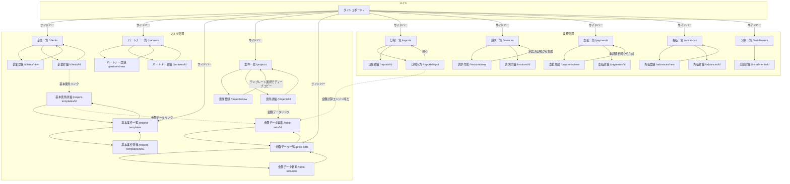

# LinksSys（業務管理・精算システム）完全版 詳細設計書

本ドキュメントは、業務管理・精算システム「LinksSys」を別のAI（または開発チーム）を用いてゼロから再開発する際の**完全な仕様書**です。データベース設計（全テーブル・全フィールド）、画面構成（全画面の項目定義とレイアウト）、画面遷移図、金額計算エンジンのロジック、ステータス制御を網羅しています。

---

## 1. システム概要

| 項目 | 内容 |
| :--- | :--- |
| システム名 | LinksSys |
| 技術スタック | Next.js (App Router) / TypeScript / Prisma / SQLite (→PostgreSQL移行可) / Vanilla CSS |
| 目的 | 企業（クライアント）から受託した業務を、パートナー（ドライバー・外注先）に委託する事業における、案件管理・日報収集・請求/支払の自動計算・明細発行を一気通貫で行う |

### コア機能一覧
1. マスタ管理（企業、パートナー、基本案件、案件、金額マスタ）
2. 日報入力と承認フロー
3. 金額計算エンジン（曜日・時間・距離の複雑な単価計算）
4. 請求書の自動生成と入金消込
5. 支払明細書の自動生成
6. 先払管理（パートナーへの前払い）
7. 分割支払管理
8. 収支管理・FB出力・収支分析

---

## 2. データベース設計（全テーブル・全フィールド定義）

### 2.1 Client（企業/クライアント）

| フィールド名 | 型 | 制約 | 説明 |
| :--- | :--- | :--- | :--- |
| id | Int | PK, autoincrement | |
| clientNo | String | @@unique([clientNo, branchNo]) | 企業番号 |
| branchNo | String | default("01") | 事業所番号 |
| name | String | required | 企業名 |
| nameKana | String? | | カナ |
| salesRepId | Int? | FK→SalesRep | 営業担当者 |
| workType | String? | | 稼働形態（派遣/運行/環境） |
| postalCode | String? | | 郵便番号 |
| billingAddress | String? | | 住所 |
| phone | String? | | 電話番号 |
| fax | String? | | FAX |
| closingDay | String? | | 締日（マスタ参照） |
| paymentDay | String? | | 支払日（マスタ参照） |
| contractDate | String? | | 基本契約日 |
| businessContent | String? | | 業務内容 |
| bankName | String? | | 銀行名 |
| branchBankName | String? | | 支店名 |
| accountNumber | String? | | 口座番号 |
| depositType | String? | | 預金種別（普通/当座） |
| accountHolder | String? | | 口座名義 |
| contractManager | String? | | 契約担当者 |
| siteManager | String? | | 現場担当者 |
| notes | String? | | 備考 |
| createdAt | DateTime | default(now()) | |
| updatedAt | DateTime | @updatedAt | |

**リレーション**: `→ ClientBillingAddress[]`, `→ DepositRecord[]`, `→ Invoice[]`, `→ MonthlyReport[]`, `→ Project[]`, `→ ProjectTemplate[]`, `→ Vehicle[]`

### 2.2 ClientBillingAddress（企業別請求先）

| フィールド名 | 型 | 制約 | 説明 |
| :--- | :--- | :--- | :--- |
| id | Int | PK | |
| clientId | Int | FK→Client (onDelete: Cascade) | |
| billingNo | String | | 請求先番号 |
| branchNo | String? | | |
| invoiceNo | String? | | |
| issueType | String? | | 発行区分 |
| multiInvoiceCategory | String? | | 複数請求区分 |
| email | String? | | |
| fax | String? | | |
| bankName〜accountHolder | String? | | 振込先情報 |
| notes | String? | | |

### 2.3 Partner（パートナー/外注先）

| フィールド名 | 型 | 制約 | 説明 |
| :--- | :--- | :--- | :--- |
| id | Int | PK | |
| partnerNo | String | @unique | パートナー番号 |
| name | String | required | 氏名 |
| nameKana | String? | | カナ |
| postalCode | String? | | 郵便番号 |
| address | String? | | 住所 |
| phone | String? | | 電話 |
| birthDate | String? | | 生年月日 |
| bloodType | String? | | 血液型 |
| bankName | String? | | 振込銀行 |
| branchName | String? | | 振込支店 |
| accountType | String? | | 口座種類 |
| accountNumber | String? | | 口座番号 |
| accountHolder | String? | | 口座名義 |
| adminFee | Float? | | 事務手数料（月額） |
| safetyFee | Float? | | 安全協力会費（月額） |
| injuryInsurance | Boolean | default(false) | 傷害保険 |
| liabilityInsurance | Boolean | default(false) | 請負損害保険 |
| cargoInsurance | Boolean | default(false) | 貨物保険 |
| gAssociation | Boolean | default(false) | G協会 |
| taxReturn | Boolean | default(false) | 確定申告 |
| pastSafetyConf | Boolean | default(false) | 安全確認済 |
| workStartDate | String? | | 稼働開始日 |
| contractDate | String? | | 契約日 |
| workHistory | String? | | 経歴 |
| continuousYears | Float? | | 継続年数 |
| licenseExpiry | String? | | 免許有効期限 |
| loopFlag | Boolean | default(false) | ループフラグ |
| notes | String? | | 備考 |
| createdAt / updatedAt | DateTime | | |

**リレーション**: `→ AdvancePayment[]`, `→ InstallmentPayment[]`, `→ MonthlyReport[]`, `→ Payment[]`, `→ Project[]`, `→ ProjectTemplate[]`, `→ Vehicle[]`

### 2.4 ProjectTemplate（基本案件/テンプレート）

| フィールド名 | 型 | 制約 | 説明 |
| :--- | :--- | :--- | :--- |
| id | Int | PK | |
| templateNo | String | @unique | テンプレート番号 |
| name | String? | | 名称 |
| clientId | Int | FK→Client | 企業 |
| branchNo | String? | | 事業所 |
| partnerId | Int? | FK→Partner | パートナー |
| salesRepId | Int? | FK→SalesRep | 営業担当 |
| closingDay | String? | | 締日 |
| workType | String? | | 稼働形態 |
| reportCountType | String? | | カウント区分（1日/半日/時間） |
| plannedStartDate | String? | | 予定開始日 |
| plannedEndDate | String? | | 予定終了日 |
| paymentType | String | default("通常") | 支払区分（通常/分割） |
| advancePrice | Float? | | 先払単価 |
| installmentPrice | Float? | | 分割単価 |
| defaultStartTime | String? | | 標準開始時間 |
| defaultEndTime | String? | | 標準終了時間 |
| defaultBreakMinutes | Int? | | 標準休憩（分） |
| isBillingTarget | Boolean | default(true) | 請求対象フラグ |
| isPaymentTarget | Boolean | default(true) | 支払対象フラグ |
| overtimeCategoryId | Int? | FK→OvertimeCategory | 残業計算区分 |
| notes | String? | | 備考 |
| createdAt / updatedAt | DateTime | | |

**リレーション**: `→ PriceSet[] (onDelete: Cascade)`, `→ Project[]`

### 2.5 Project（案件）

| フィールド名 | 型 | 制約 | 説明 |
| :--- | :--- | :--- | :--- |
| id | Int | PK | |
| projectNo | String | @unique | 案件番号 |
| name | String? | | 案件名称 |
| templateId | Int? | FK→ProjectTemplate | 元テンプレートID |
| clientId | Int | FK→Client | 企業 |
| branchNo | String? | | 事業所 |
| partnerId | Int? | FK→Partner | パートナー |
| salesRepId | Int? | FK→SalesRep | 営業担当 |
| closingDay | String? | | 締日 |
| workType | String? | | 稼働形態 |
| reportCountType | String? | | カウント区分 |
| startDate | String? | | 開始日 |
| endDate | String? | | 終了日 |
| paymentType | String | default("通常") | 支払区分 |
| advancePrice | Float? | | 先払単価 |
| installmentPrice | Float? | | 分割単価 |
| defaultStartTime | String? | | 標準開始時間 |
| defaultEndTime | String? | | 標準終了時間 |
| defaultBreakMinutes | Int? | | 標準休憩（分） |
| isBillingTarget | Boolean | default(true) | 請求対象フラグ |
| isPaymentTarget | Boolean | default(true) | 支払対象フラグ |
| overtimeCategoryId | Int? | FK→OvertimeCategory | 残業計算区分 |
| notes | String? | | 備考 |
| createdAt / updatedAt | DateTime | | |

**リレーション**: `→ AdvancePayment[]`, `→ InvoiceItem[]`, `→ MonthlyReport[]`, `→ PaymentItem[]`, `→ PriceSet[] (onDelete: Cascade)`

> [!IMPORTANT]
> **ディープコピー仕様**: ProjectTemplate から Project を作成する際、ProjectTemplate に紐付く PriceSet と PriceRow は「参照」ではなく「複製（ディープコピー）」し、新しい PriceSet は `projectId = 新案件ID`, `templateId = null` で保存すること。テンプレートの価格改定が既存案件に影響しないようにするため。

### 2.6 PriceSet（金額データセット）

| フィールド名 | 型 | 制約 | 説明 |
| :--- | :--- | :--- | :--- |
| id | Int | PK | |
| priceSetNo | String | @unique | 金額データ番号 |
| name | String? | | 名称 |
| validFrom | String | required | 適用開始日 (YYYY-MM-DD) |
| validTo | String? | | 適用終了日 (YYYY-MM-DD) |
| projectId | Int? | FK→Project (onDelete: Cascade) | 案件紐付け |
| templateId | Int? | FK→ProjectTemplate (onDelete: Cascade) | テンプレート紐付け |
| notes | String? | | |
| createdAt / updatedAt | DateTime | | |

**リレーション**: `→ PriceRow[] (onDelete: Cascade)`

### 2.7 PriceRow（金額明細行）

| フィールド名 | 型 | 制約 | 説明 |
| :--- | :--- | :--- | :--- |
| id | Int | PK | |
| priceSetId | Int | FK→PriceSet (onDelete: Cascade) | |
| priceCategoryId | Int | FK→PriceCategory | 料金種別 |
| dayType | String | required | 曜日区分（平日/土曜/日曜/祝日等） |
| priceName | String | required | 料金名 |
| displayName | String? | | 表示名 |
| calcType | String | required | 計算方法（日極/時間） |
| billingPrice1 | Float? | default(0) | 請求・基本単価 |
| billingPrice2 | Float? | | 請求・超過単価 |
| billingPrice3 | Float? | | 請求・深夜単価 |
| billingPrice4 | Float? | | 請求・深夜超過単価 |
| paymentPrice1 | Float? | | 支払・基本単価 |
| paymentPrice2 | Float? | | 支払・超過単価 |
| paymentPrice3 | Float? | | 支払・深夜単価 |
| paymentPrice4 | Float? | | 支払・深夜超過単価 |
| tableConfig | String? | | 距離テーブル設定（JSON） |
| billingDescriptionFormat | String? | | 請求書明細の書式テンプレート |
| paymentDescriptionFormat | String? | | 支払明細の書式テンプレート |

### 2.8 PriceCategory（料金種別マスタ）

| フィールド名 | 型 | 制約 | 説明 |
| :--- | :--- | :--- | :--- |
| id | Int | PK | |
| code | String | @unique | コード |
| name | String | | 種別名（日極、時間、深夜、超過、距離等） |
| description | String? | | |
| notes | String? | | |

### 2.9 MonthlyReport（月次日報ヘッダ）

| フィールド名 | 型 | 制約 | 説明 |
| :--- | :--- | :--- | :--- |
| id | Int | PK | |
| projectId | Int | FK→Project | 案件 |
| partnerId | Int | FK→Partner | パートナー |
| clientId | Int | FK→Client | 企業 |
| periodStart | String | | 期間開始日 |
| periodEnd | String | | 期間終了日 |
| billingMonth | String? | | 請求月（YYYY-MM） |
| closingDay | String? | | 締日 |
| approvalStatus | String | default("入力中") | 承認ステータス |
| approvalComment | String? | | 承認コメント |
| approvalRequestedAt | DateTime? | | 承認依頼日時 |
| approvedAt | DateTime? | | 承認日時 |
| inputUser | String? | | 入力者 |
| headerComment | String? | | ヘッダーコメント |
| notes | String? | | |
| createdAt / updatedAt | DateTime | | |

**承認ステータスの値**: `入力中` → `承認待ち` → `承認済` / `差戻し` / `訂正中`

**リレーション**: `→ DailyReportEntry[] (onDelete: Cascade)`, `→ DailyReportStatus[] (onDelete: Cascade)`, `→ ReportChangeLog[] (onDelete: Cascade)`

### 2.10 DailyReportEntry（日次日報明細）

| フィールド名 | 型 | 制約 | 説明 |
| :--- | :--- | :--- | :--- |
| id | Int | PK | |
| monthlyReportId | Int | FK→MonthlyReport (onDelete: Cascade) | |
| date | String | | 日付 (YYYY-MM-DD) |
| lineNo | Int | default(1) | 行番号（同日複数行対応） |
| dayOfWeek | String? | | 曜日（平日/土曜/日曜/祝日等） |
| startTime | String? | | 開始時間 (HH:mm) |
| endTime | String? | | 終了時間 (HH:mm) |
| distance | Float? | | 走行距離 (km) |
| excessDistance | Float? | | 超過距離 (km) |
| excessHours | Float? | | 超過時間 |
| breakMinutes | Int? | | 休憩（分） |
| restraintHours | Float? | | 拘束時間 |
| workHours | Float? | | 実働時間 |
| shortageHours | Float? | | 不足時間 |
| nightHours | Float? | | 深夜時間 |
| nightExcessHours | Float? | | 深夜超過時間 |
| tollFee | Float? | | 有料道路代 |
| parkingFee | Float? | | 駐車場代 |
| transportFee | Float? | | 交通費 |
| useSpotPrice | Boolean | default(false) | スポット単価使用フラグ |
| spotBasePrice〜spotPaymentNightOt | Float? | default(0) | スポット単価（請求・支払それぞれ4種類） |
| otherAdditionAmount | Float? | default(0) | その他加算 |
| calcBillingAmount | Float? | | 算出請求額 |
| calcPaymentAmount | Float? | | 算出支払額 |
| lineComment | String? | | 行コメント |
| notes | String? | | 備考 |
| isTraining | Boolean | default(false) | 研修フラグ |
| isUnnecessary | Boolean | default(false) | 不要（非稼働）フラグ |
| appliedPriceSetId | Int? | | 適用された金額データID |

**リレーション**: `→ DailyReportTask[] (onDelete: Cascade)`

### 2.11 DailyReportTask / DailyReportStatus / ReportChangeLog

| テーブル | 主要フィールド | 説明 |
| :--- | :--- | :--- |
| DailyReportTask | entryId(FK), taskNo, description, amount | 日次エントリに紐付く個別タスク |
| DailyReportStatus | monthlyReportId(FK), date, isCompleted | 日付ごとの入力完了フラグ。@@unique([monthlyReportId, date]) |
| ReportChangeLog | monthlyReportId(FK), entryId, fieldName, oldValue, newValue, changedBy, changedAt | 変更監査ログ |

### 2.12 Invoice（請求書）

| フィールド名 | 型 | 制約 | 説明 |
| :--- | :--- | :--- | :--- |
| id | Int | PK | |
| clientId | Int | FK→Client | 企業 |
| invoiceNumber | String | @unique | 請求書番号 |
| revisionNumber | Int | default(0) | 改訂番号 |
| periodStart / periodEnd | String | | 対象期間 |
| issueDate | String | | 発行日 |
| subtotal | Float | default(0) | 小計 |
| taxAmount | Float | default(0) | 税額 |
| totalAmount | Float | default(0) | 合計額 |
| dueDate | String? | | 支払期日 |
| depositStatus | String | default("未入金") | 入金ステータス |
| depositDate | String? | | 入金日 |
| depositAmount | Float? | | 入金額 |
| pdfPath | String? | | PDF保存先 |
| status | String | default("下書き") | 請求ステータス |
| notes | String? | | |
| createdBy / updatedBy | String? | | |
| createdAt / updatedAt | DateTime | | |

**リレーション**: `→ InvoiceItem[] (onDelete: Cascade)`, `→ InvoiceHistory[] (onDelete: Cascade)`

### 2.13 InvoiceItem（請求明細行）

| フィールド名 | 型 | 制約 | 説明 |
| :--- | :--- | :--- | :--- |
| id | Int | PK | |
| invoiceId | Int | FK→Invoice (onDelete: Cascade) | |
| projectId | Int? | FK→Project | 案件 |
| lineNo | Int | | 行番号 |
| description | String | | 摘要 |
| unitPrice | Float | | 単価 |
| quantity | Float | | 数量 |
| amount | Float | | 金額 |
| notes | String? | | |
| isManual | Boolean | default(false) | 手動追加行フラグ |
| sourceReportEntryId | Int? | | 元日報エントリID |
| sourceType | String? | | ソース種別 |
| snapshotPriceId | Int? | | スナップショット価格ID |

### 2.14 Payment（支払明細書）

| フィールド名 | 型 | 制約 | 説明 |
| :--- | :--- | :--- | :--- |
| id | Int | PK | |
| partnerId | Int | FK→Partner | パートナー |
| paymentNumber | String | @unique | 支払番号 |
| periodStart / periodEnd | String | | 対象期間 |
| paymentDate | String? | | 支払日 |
| grossAmount | Float | default(0) | 総支払額 |
| deductionAmount | Float | default(0) | 控除額 |
| advanceDeduction | Float | default(0) | 先払控除額 |
| transferFee | Float | default(0) | 振込手数料 |
| penaltyAmount | Float | default(0) | 違約金 |
| netAmount | Float | default(0) | 差引支払額 |
| paymentType | String | default("通常") | 支払区分 |
| paymentStatus | String | default("未支払") | 支払ステータス |
| actualPaymentDate | String? | | 実支払日 |
| actualPaymentAmount | Float? | | 実支払額 |
| pdfPath | String? | | PDF保存先 |
| notes | String? | | |
| createdBy / updatedBy | String? | | |
| createdAt / updatedAt | DateTime | | |

**リレーション**: `→ PaymentItem[] (onDelete: Cascade)`

### 2.15 PaymentItem（支払明細行）

InvoiceItem と同一構造。`paymentId` (FK→Payment) で紐付け。

### 2.16 AdvancePayment（先払管理）

| フィールド名 | 型 | 制約 | 説明 |
| :--- | :--- | :--- | :--- |
| id | Int | PK | |
| projectId | Int? | FK→Project (onDelete: Cascade) | |
| partnerId | Int | FK→Partner | |
| paymentType | String | default("先払い") | |
| targetMonth | String? | | 対象月 |
| closingPattern | String? | | 締めパターン |
| periodIndex | Int? | | 期間インデックス |
| workDays | Int? | | 出勤日数 |
| unitPrice | Float? | | 1日あたり単価 |
| fee | Float | default(0) | 手数料 |
| isTarget | Boolean | default(false) | 対象フラグ |
| applicationDate | String? | | 申請日 |
| advanceAmount | Float | required | 先払金額 |
| scheduledDate | String? | | 支払予定日 |
| actualDate | String? | | 実支払日 |
| paymentStatus | String | default("未支払") | |
| balance | Float | default(0) | 残高 |
| notes | String? | | |
| createdBy / updatedBy | String? | | |
| createdAt / updatedAt | DateTime | | |

**ユニーク制約**: `@@unique([projectId, targetMonth, periodIndex])`

### 2.17 InstallmentPayment（分割支払管理）

| フィールド名 | 型 | 制約 | 説明 |
| :--- | :--- | :--- | :--- |
| id | Int | PK | |
| partnerId | Int | FK→Partner | |
| applicationDate | String | | 申請日 |
| requestedAmount | Float | | 希望額 |
| approvedAmount | Float? | | 承認額 |
| approvalDate | String? | | 承認日 |
| scheduledDate | String? | | 支払予定日 |
| actualDate | String? | | 実支払日 |
| paymentStatus | String | default("未支払") | |
| balance | Float | default(0) | 残高 |
| repaymentStatus | String | default("返済中") | 返済ステータス |
| transferFee | Float | default(0) | 振込手数料 |
| notes | String? | | |
| createdBy / updatedBy | String? | | |
| createdAt / updatedAt | DateTime | | |

### 2.18 その他マスタ・設定テーブル

| テーブル名 | 主要フィールド | 説明 |
| :--- | :--- | :--- |
| SalesRep | name, phone, email | 営業担当者マスタ |
| ClosingDay | code(@unique), name | 締日マスタ |
| PaymentDay | code(@unique), name | 支払日マスタ |
| CalcType | code(@unique), name | 計算区分マスタ |
| DayTypeCategory | code(@unique), name | 曜日区分マスタ |
| WorkType | name | 稼働形態マスタ |
| ReportCountType | name | カウント区分マスタ |
| Holiday | date(@unique), name | 祝日マスタ |
| Vehicle | clientId?, partnerId?, vehicleNumber, vehicleInspExpiry, insuranceExpiry | 車両情報 |
| OvertimeCategory | name, baseTime, thresholdMinutes, lessThanAction, moreThanAction | 残業計算区分 |
| DescriptionPlaceholder | code(@unique), name | 明細書式プレースホルダ |
| CompanyBankAccount | bankName, branchName, accountType, accountNumber, accountHolder | 自社口座 |
| DepositRecord | clientId?, depositDate, amount, bankInfo, matchStatus, invoiceRef | 入金記録 |
| InvoiceHistory | invoiceId, revisionNumber, data(JSON) | 請求改訂履歴 |
| SystemSetting | key(@unique), value | システム設定KVS |
| User | email(@unique), passwordHash, name, role | ユーザー/認証 |
| ExcelImportSession | status, parsedData, mappedConfig | Excel取込セッション |
| CashManagementDay | day(@unique), name | 資金管理日 |
| CashEvent | date, amount, type, category, bankName, description, isSpot | 収支イベント |
| CashTransferDate | year, month, day, transferDate @@unique([year,month,day]) | 振替日マスタ |
| UILayout | screenKey(@unique), config(JSON), isActive | UI配置設定 |
| UILayoutBackup | uiLayoutId, config, notes | UI配置バックアップ |

---

## 3. 画面構成・一覧（全画面定義）

### 3.1 サイドバーナビゲーション構造

```
📊 メイン
  └─ ダッシュボード                /

🏢 マスタ管理
  ├─ 企業管理                    /clients
  ├─ パートナー管理               /partners
  ├─ 基本案件管理                 /project-templates
  ├─ 案件管理                    /projects
  └─ 金額データ管理               /price-sets

📝 業務管理
  ├─ 日報管理                    /reports
  ├─ 請求管理                    /invoices
  ├─ 支払管理                    /payments
  ├─ 先払管理                    /advances
  └─ 分割支払管理                 /installments

⚖️ 外部連携・分析
  ├─ 収支管理                    /cash-management
  ├─ 総振管理・FB出力              /transfers
  ├─ 入金消込                    /deposits
  └─ 収支分析                    /analytics

⚙️ 設定
  ├─ マスター設定                 /masters
  └─ Excel取り込み               /master-import
```

### 3.2 各画面の構成とルーティング

#### ① ダッシュボード (`/`)
- 登録件数サマリー（企業、パートナー、案件、日報）
- 「処理が必要な日報」一覧（承認待ち・差戻し等）
- 「未入金の請求」一覧（期日超過表示）

#### ② 企業管理 (`/clients`)
| ルート | 画面 | 主要操作 |
| :--- | :--- | :--- |
| `/clients` | 一覧 | 検索・フィルタ・ソート・詳細遷移 |
| `/clients/new` | 新規登録モーダル | 企業名(必須)、企業No、住所等の入力 |
| `/clients/[id]` | 詳細・編集 | 基本情報/連絡先/銀行/車両/基本案件(子テーブル)/備考の各セクション |

**詳細画面レイアウト**:
- 基本情報: 企業No, 事業所No, 企業名, カナ, 営業担当
- 基本情報2段目: 稼働形態, 締日, 支払日
- 連絡先: 郵便番号, 住所, 電話, FAX
- 車両エリア: 車両情報テーブル（パートナー側と共有）
- 契約: 契約日, 契約担当, 現場担当, 業務内容
- 銀行: 銀行名, 支店名, 口座番号, 預金種別, 名義
- 基本案件エリア: 紐付く基本案件(ProjectTemplate)のリスト表示
- 備考

#### ③ パートナー管理 (`/partners`)
| ルート | 画面 | 主要操作 |
| :--- | :--- | :--- |
| `/partners` | 一覧 | 検索・ソート |
| `/partners/new` | 新規登録モーダル | |
| `/partners/[id]` | 詳細・編集 | |

**詳細画面レイアウト**:
- 基本情報: No, 氏名, カナ, 電話, 血液型, 郵便番号, 住所, 生年月日
- 銀行: 銀行, 支店, 種類, 番号, 名義
- 控除: 事務手数料, 安全協力会費
- 保険チェック: 傷害, 請負, 貨物（チェックボックス群）
- 稼働: 開始日, 継続年数
- 免許: 有効期限
- 車両エリア: 車両情報テーブル
- 備考

#### ④ 基本案件管理 (`/project-templates`)
| ルート | 画面 | 主要操作 |
| :--- | :--- | :--- |
| `/project-templates` | 一覧 | 検索・フィルタ |
| `/project-templates/new` | 新規登録モーダル | |
| `/project-templates/[id]` | 詳細・編集 | |

#### ⑤ 案件管理 (`/projects`)
| ルート | 画面 | 主要操作 |
| :--- | :--- | :--- |
| `/projects` | 一覧 | 検索・フィルタ・ソート |
| `/projects/new` | 新規登録モーダル | 基本案件(テンプレート)選択 → 自動入力 |
| `/projects/[id]` | 詳細・編集 | |

**詳細画面レイアウト**:
- 基本情報: 案件No, 案件名称, 企業(選択), パートナー(選択), 営業担当(選択), 稼働形態
- 稼働: 開始日, 終了日, 締日, カウント区分, 開始時間, 終了時間, 休憩(分)
- 金額: 支払区分, 分割単価, 残業計算区分
- 金額履歴エリア: 紐付く金額データ(PriceSet)のリスト・ボタン群
- 備考

#### ⑥ 金額データ管理 (`/price-sets`)
| ルート | 画面 | 主要操作 |
| :--- | :--- | :--- |
| `/price-sets` | 一覧 | 検索・フィルタ |
| `/price-sets/new` | 新規作成 | |
| `/price-sets/[id]` | 編集 | |

**編集画面レイアウト**:
- ヘッダ: 名称, 適用開始日(必須), 適用終了日, 金額データNo
- 連携先: 基本案件(選択), 案件(選択)
- 料金行テーブル: 曜日, 料金名, 請求/支払用書式, 料金種別, 計算方法, 基本単価(請求/支払), 超過単価(請求/支払), 削除ボタン

#### ⑦ 日報管理 (`/reports`)
| ルート | 画面 | 主要操作 |
| :--- | :--- | :--- |
| `/reports` | 一覧 | 年月選択・フィルタ（案件No/企業/パートナー/締日/進捗/ステータス） |
| `/reports/[id]` | 詳細（参照） | |
| `/reports/input?reportId=X` | 日報入力画面 | カレンダー形式の1ヶ月入力テーブル |

**日報入力画面（最重要画面）のレイアウト**:
- ヘッダ: 対象年月表示, 案件名表示, ステータス切替ボタン, 全体保存ボタン
- サマリーエリア: 案件情報（締日等）, 合計値表示（実働/残業/金額等）
- テーブル:
  | 列 | 内容 |
  | :--- | :--- |
  | 詳細展開 | 展開ボタン（深夜/スポット/金額訂正を表示） |
  | 不要チェック | 非稼働日マーク |
  | 日付/曜 | MM/DD (曜日) |
  | 開始時間 | HH:mm |
  | 終了時間 | HH:mm |
  | 休憩(分) | HH:mm形式入力 |
  | 拘束時間 | 自動計算(終了-開始) |
  | 実働時間 | 自動計算(拘束-休憩) |
  | 残業時間 | 基本時間超過分 |
  | 不足時間 | 基本時間不足分 |
  | 走行距離 | 数値(km) |
  | 超過距離 | 規定超過分 |
  | 有料道路 | 金額(円) |
  | 駐車場 | 金額(円) |
  | 交通費 | 金額(円) |
  | 備考 | 自由入力 |
  | 行操作 | 追加[+] / 削除[x] |
- 詳細展開エリア: 深夜時間調整、スポット加算（請求/支払別）、金額訂正、行コメント

#### ⑧ 請求管理 (`/invoices`)
| ルート | 画面 | 主要操作 |
| :--- | :--- | :--- |
| `/invoices` | 一覧 | 年月選択・フィルタ（案件No/企業/案件名/ステータス/除外） |
| `/invoices/new` | 請求書作成 | |
| `/invoices/[id]` | 請求書詳細 | |

**一覧テーブル列**: 案件No, 企業, 案件名, ステータス(badge), 請求書No, 請求合計額, 操作, 除外切替

#### ⑨ 支払管理 (`/payments`)
| ルート | 画面 | 主要操作 |
| :--- | :--- | :--- |
| `/payments` | 一覧 | 年月選択・フィルタ（パートナーNo/名前/ステータス） |
| `/payments/new` | 支払明細作成 | |
| `/payments/[id]` | 支払明細詳細 | |

**一覧テーブル列**: パートナーNo, パートナー名, 案件数, ステータス(badge), 支払明細No, 支払合計額, 操作, 旬払い

#### ⑩ 先払管理 (`/advances`)
| ルート | 画面 | 主要操作 |
| :--- | :--- | :--- |
| `/advances` | 一覧 | 年月選択・再計算/生成ボタン・フィルタ |
| `/advances/new` | 新規作成 | |
| `/advances/[id]` | 詳細 | |

**一覧テーブル列**: 年月, 締日, 期間, パートナー, 案件名, 出勤日数, 先払単価, 支払額, 手数料, 状態(badge), 操作

#### ⑪ 分割支払管理 (`/installments`)
| ルート | 画面 | 主要操作 |
| :--- | :--- | :--- |
| `/installments` | 一覧 | フィルタ |
| `/installments/[id]` | 詳細 | |

#### ⑫ 収支管理 (`/cash-management`)
- 単一ページ。カレンダー形式で日ごとの収支を表示・編集。

#### ⑬ 総振管理・FB出力 (`/transfers`)
- 単一ページ。振込データの一覧と全銀フォーマット(FB)データ出力。

#### ⑭ 入金消込 (`/deposits`)
| ルート | 画面 | 主要操作 |
| :--- | :--- | :--- |
| `/deposits` | 消込画面 | 入金記録の登録、請求書との消込マッチング |
| `/deposits/history` | 消込履歴 | |

#### ⑮ 収支分析 (`/analytics`)
- 単一ページ。月別の売上/支払/利益のグラフ表示。

#### ⑯ マスター設定 (`/masters`)
| ルート | 画面 |
| :--- | :--- |
| `/masters` | メインメニュー（各マスタへのリンク） |
| `/masters/system` | システムマスタ一括管理（曜日区分/計算区分/締日/支払日/稼働形態/営業担当/祝日/テキスト変換/料金種別/プレースホルダ等のタブ切替） |
| `/masters/overtime-categories` | 残業計算区分管理 |
| `/masters/price-categories` | 料金種別管理 |
| `/masters/sales-reps` | 営業担当者管理 |
| `/masters/ui-builder` | UI配置カスタマイズ |

#### ⑰ Excel取り込み (`/master-import`)
| ルート | 画面 |
| :--- | :--- |
| `/master-import` | ファイルアップロード・パース開始 |
| `/master-import/[sessionId]` | マッピング設定・インポート実行 |

---

## 4. 画面遷移図



---

## 5. 金額計算エンジン（完全仕様）

### 5.1 設定値定義
```typescript
// 曜日区分の優先順位 (フォールバック検索順)
const DAY_TYPE_PRIORITY = ['平日', '半日', '土曜', '日曜', '祝日', 'その他'];

// 計算区分の優先順位
const CALC_TYPE_PRIORITY = ['日極', '時間', '距離'];

// 時間単価の自動算出設定
const HOURLY_PRICE_CONFIG = {
    autoDeriveFromDaily: true,       // 日極から時間単価を算出するか
    useHourlyOnShortage: true,       // 不足時間時に時間単価計算へ移行するか
};
```

### 5.2 計算フロー（1日1行あたり）
1. `isUnnecessary === true` → スキップ（0円）
2. `useSpotPrice === true` → スポット単価で計算（マスタ無視）
3. 該当日付の PriceSet を `validFrom/validTo` で特定
4. 曜日区分 (`dayOfWeek`) に一致する PriceRow を検索、なければフォールバック
5. 計算区分判定:
   - **日極**: 基本単価 = `billingPrice1` そのまま
   - **時間**: 基本単価 = `billingPrice1 × workHours`
   - **日極 + 不足時間**: `workHours < 標準稼働時間` → `時間単価(=日極÷標準稼働) × workHours`
6. 超過計算: `excessHours` に端数処理（interval, threshold, FLOOR/CEIL/ROUND）を適用後 × `billingPrice2`
7. 深夜: `nightHours × 深夜単価`, `nightExcessHours × 深夜超過単価`
8. 経費加算: `tollFee + parkingFee + transportFee`
9. 結果を `calcBillingAmount` / `calcPaymentAmount` へ保存
10. 使用した PriceSet の ID を `appliedPriceSetId` に記録

### 5.3 端数処理（RoundingRule）
| 設定キー | interval | threshold | method | 説明 |
| :--- | :--- | :--- | :--- | :--- |
| DEFAULT | 1 | 0 | FLOOR | 1分単位切り捨て |
| 30MIN_15MIN_THRESHOLD | 30 | 15 | ROUND | 30分単位, 15分未満切捨 |
| 15MIN_CEIL | 15 | 1 | CEIL | 15分単位, 1分以上切上 |

### 5.4 締日と期間計算
```
締日「末」→ 期間: 当月1日 〜 当月末日
締日「15」→ 期間: 前月16日 〜 当月15日
```

### 5.5 明細書式プレースホルダ
| コード | 置換内容 |
| :--- | :--- |
| `{Cp}` / `{企業}` | クライアント名 |
| `{Pt}` / `{パートナー名}` | パートナー名 |
| `{Pr}` / `{案件名}` | 案件名 |
| `{Ym}` / `{年月}` | 対象年月 |

---

## 6. API設計（RESTful）

各機能に対応する API Route Handler（Next.js App Router）:

| パス | メソッド | 機能 |
| :--- | :--- | :--- |
| `/api/clients` | GET/POST | 企業一覧取得/新規作成 |
| `/api/clients/[id]` | GET/PUT/DELETE | 企業詳細/更新/削除 |
| `/api/partners` | GET/POST | パートナー一覧/作成 |
| `/api/partners/[id]` | GET/PUT/DELETE | パートナー詳細/更新/削除 |
| `/api/project-templates` | GET/POST | 基本案件一覧/作成 |
| `/api/project-templates/[id]` | GET/PUT/DELETE | 基本案件詳細/更新/削除 |
| `/api/projects` | GET/POST | 案件一覧/作成（POST時にディープコピー処理） |
| `/api/projects/[id]` | GET/PUT/DELETE | 案件詳細/更新/削除 |
| `/api/price-sets` | GET/POST | 金額データ一覧/作成 |
| `/api/price-sets/[id]` | GET/PUT/DELETE | 金額データ詳細/更新/削除（PriceRow含む） |
| `/api/price-categories` | GET/POST | 料金種別一覧/作成 |
| `/api/monthly-reports` | GET/POST | 月次日報一覧/作成 |
| `/api/monthly-reports/[id]` | GET/PUT/DELETE | 月次日報詳細/更新/削除（**承認済の場合は403**） |
| `/api/invoices` | GET/POST | 請求書一覧/作成 |
| `/api/invoices/[id]` | GET/PUT/DELETE | 請求書詳細/更新/削除 |
| `/api/payments` | GET/POST | 支払明細一覧/作成 |
| `/api/payments/[id]` | GET/PUT/DELETE | 支払明細詳細/更新/削除 |
| `/api/advances` | GET/POST | 先払一覧/作成 |
| `/api/advances/[id]` | GET/PUT/DELETE | 先払詳細/更新/削除 |
| `/api/installments` | GET/POST | 分割支払一覧/作成 |
| `/api/installments/[id]` | GET/PUT/DELETE | 分割支払詳細/更新/削除 |
| `/api/deposits` | GET/POST | 入金消込一覧/作成 |
| `/api/transfers` | GET/POST | 総振データ/FB出力 |
| `/api/analytics` | GET | 収支分析データ |
| `/api/cash-management` | GET/POST/PUT | 収支管理 |
| `/api/masters/...` | GET/POST/PUT/DELETE | 各マスタの CRUD |
| `/api/holidays` | GET/POST | 祝日マスタ |
| `/api/sales-reps` | GET/POST | 営業担当者マスタ |
| `/api/closing-days` | GET | 締日マスタ |
| `/api/master-import` | POST | Excelインポート |
| `/api/master-import/[sessionId]` | GET/PUT | インポートセッション管理 |

---

## 7. ビジネスルール・制約の総まとめ

> [!CAUTION]
> 以下のルールは、システムの整合性を保つために**必ず**実装が必要です。

1. **ディープコピー**: 案件作成時、テンプレートの PriceSet/PriceRow を複製する
2. **承認ロック**: `approvalStatus = "承認済"` の MonthlyReport は配下データ変更不可 (API で 403)
3. **isUnnecessary**: 不要日は金額計算を完全スキップ（0円）
4. **useSpotPrice**: `true` の場合は PriceSet を無視し、スポット単価フィールドで計算
5. **祝日判定**: Holiday テーブルに登録された日付は曜日に関わらず「祝日」として扱う
6. **適用期間の排他**: 同一案件内で PriceSet の validFrom〜validTo が重複してはならない
7. **カスケード削除**: MonthlyReport削除→DailyReportEntry/Status/ChangeLog、PriceSet削除→PriceRow、Project削除→PriceSet、等
8. **変更監査**: 金額・時間に関わるフィールド変更時は ReportChangeLog に oldValue/newValue を記録
9. **請求/支払生成**: 日報の `calcBillingAmount`/`calcPaymentAmount` を再計算せず合算してInvoice/Paymentを生成

---

## 8. 機能ごとの詳細設計

### 8.1 企業管理機能

#### CRUD仕様
| 操作 | エンドポイント | 詳細 |
| :--- | :--- | :--- |
| 一覧取得 | `GET /api/clients` | クエリ: `search`（企業名/カナ/企業Noで部分一致検索）, `limit`（デフォルト2000）。`salesRep.name` と `projectTemplates` の件数を include。`clientNo` の昇順でソート |
| 新規作成 | `POST /api/clients` | リクエストボディに車両情報（`vehicles[]`）を含む場合、ネストされた create で同時登録。`salesRepId` は文字列→Int変換 |
| 詳細取得 | `GET /api/clients/[id]` | `salesRep`, `billingAddresses`, `projectTemplates`, `vehicles`, `projects`（パートナー名含む、開始日降順）を include |
| 更新 | `PUT /api/clients/[id]` | 車両情報は**全削除＋再作成**方式（`deleteMany` → `create`）。空文字のフィールドは `null` に変換して保存 |
| 削除 | `DELETE /api/clients/[id]` | 物理削除。紐付く Vehicle はカスケード削除 |

#### バリデーション・エラーハンドリング
- `clientNo + branchNo` のユニーク制約違反（Prisma P2002）→ `409 Conflict`「企業No + 事業所No の組み合わせが既に存在します」
- `name`（企業名）は必須

#### 画面動作の詳細
- **一覧画面**: テーブル行クリック → 詳細画面へ遷移（`/clients/[id]`）
- **新規登録**: モーダル形式のフォーム → 保存後一覧へ戻る
- **詳細画面**: セクション分割されたフォーム（基本情報/連絡先/車両/契約/銀行/基本案件リスト/備考）。ページ上部に「戻る」「削除」「保存」ボタン

---

### 8.2 パートナー管理機能

#### CRUD仕様
| 操作 | エンドポイント | 詳細 |
| :--- | :--- | :--- |
| 一覧取得 | `GET /api/partners` | `search`（名前/カナ/パートナーNoで部分一致）, `limit`。`partnerNo` 昇順 |
| 新規作成 | `POST /api/partners` | 車両情報のネスト create 対応。`adminFee`, `safetyFee` は Float 変換 |
| 詳細取得 | `GET /api/partners/[id]` | `vehicles`, `projects`（企業名含む）を include |
| 更新 | `PUT /api/partners/[id]` | 車両は全削除＋再作成方式 |
| 削除 | `DELETE /api/partners/[id]` | 物理削除 |

#### バリデーション
- `partnerNo` は @unique。重複時は Prisma P2002 エラー
- `name`（氏名）は必須

#### 画面動作の詳細
- **詳細画面セクション**: 基本情報 / 銀行 / 控除（事務手数料・安全協力会費）/ 保険チェックボックス群 / 稼働情報 / 免許 / 車両テーブル / 備考
- **車両テーブル**: 行追加（＋ボタン）・行削除（×ボタン）。車両番号・車検期限・保険期限の3列

---

### 8.3 基本案件管理機能（ProjectTemplate）

#### CRUD仕様
| 操作 | エンドポイント | 詳細 |
| :--- | :--- | :--- |
| 一覧取得 | `GET /api/project-templates` | `search`, `clientId` でフィルタ可。`client.name`, `partner.name`, `salesRep.name`, `priceSets` 件数を include |
| 新規作成 | `POST /api/project-templates` | `templateNo` 必須（@unique）。数値フィールドの型変換処理あり |
| 詳細取得 | `GET /api/project-templates/[id]` | `client`, `partner`, `salesRep`, `priceSets`（rows含む）, `overtimeCategory` を include |
| 更新 | `PUT /api/project-templates/[id]` | 全フィールド更新対応 |
| 削除 | `DELETE /api/project-templates/[id]` | 物理削除。紐付く PriceSet はカスケード削除（DB定義済み） |

#### 画面動作の詳細
- **詳細画面**: 企業/パートナー/営業担当はプルダウン（検索可能コンボボックス）で選択
- **金額データセクション**: 紐付く PriceSet の一覧表示。「金額データ追加」ボタンで `/price-sets/new?templateId=X` へ遷移

---

### 8.4 案件管理機能（Project）

#### CRUD仕様
| 操作 | エンドポイント | 詳細 |
| :--- | :--- | :--- |
| 一覧取得 | `GET /api/projects` | `search`（案件No/企業名/パートナー名）, `clientId` フィルタ。`client`, `partner`, `salesRep`, `template`, `monthlyReports`（entries含む）を include。ID降順 |
| 新規作成 | `POST /api/projects` | `projectNo` 未指定時は**自動採番**（`PRJ-0001` 形式）。数値フィールドの型変換処理あり |
| 詳細取得 | `GET /api/projects/[id]` | `client`, `partner`, `salesRep`, `template`, `priceSets`（rows含む）, `overtimeCategory` を include |
| 更新 | `PUT /api/projects/[id]` | 全フィールド更新対応 |
| 削除 | `DELETE /api/projects/[id]` | 物理削除。紐付く PriceSet, MonthlyReport 等はカスケード削除 |

#### 自動採番ロジック（projectNo）
```
プレフィックス: "PRJ-"
既存の最大値を取得 → 末尾の数値部分 +1 → 4桁ゼロ埋め
例: PRJ-0001 → PRJ-0002 → PRJ-0003
```

#### テンプレートからの作成フロー（画面側ロジック）
1. 新規登録画面で「基本案件」を選択
2. 選択した `ProjectTemplate` の属性値（企業、パートナー、営業担当、締日、稼働形態、標準時間、休憩時間、支払区分等）をフォームに自動入力
3. **PriceSet のディープコピーは画面側（フロント）で実行**: テンプレートの PriceSet を取得 → 各 PriceSet・PriceRow の ID を除去 → `POST /api/price-sets` で案件ID紐付けで新規作成

---

### 8.5 金額データ管理機能（PriceSet / PriceRow）

#### CRUD仕様
| 操作 | エンドポイント | 詳細 |
| :--- | :--- | :--- |
| 一覧取得 | `GET /api/price-sets` | `projectId`, `templateId` でフィルタ。`project`（client, partner含む）, `template`（client含む）, `rows`（priceCategory含む）を include。**曜日マスタ（DayTypeCategory）の順序でソート** |
| 新規作成 | `POST /api/price-sets` | `priceSetNo` 未指定時は**自動採番**。`rows` はネスト create。料金名のプレースホルダ解決（`resolvePlaceholders`）を実行 |
| 詳細取得 | `GET /api/price-sets/[id]` | rows 含む全データ取得 |
| 更新 | `PUT /api/price-sets/[id]` | rows は**全削除＋再作成**方式 |
| 削除 | `DELETE /api/price-sets/[id]` | 物理削除。紐付く PriceRow はカスケード削除 |

#### 自動採番ロジック（priceSetNo）
```
フォーマット: "PS-YYYYMMDD-NNN"
例: PS-20260801-001 → PS-20260801-002
同日内でインクリメント
```

#### PriceRow のソート順
DayTypeCategoryマスタの `id` 順でソート。曜日マスタに存在しない dayType は末尾（999）に配置。同一 dayType 内は PriceRow の `id` 昇順。

#### プレースホルダ解決
PriceRow の `priceName` と `displayName` に含まれるプレースホルダ文字列は、保存時に `DescriptionPlaceholder` マスタを参照して展開される。

---

### 8.6 日報管理機能（MonthlyReport / DailyReportEntry）

#### MonthlyReport CRUD仕様
| 操作 | エンドポイント | 詳細 |
| :--- | :--- | :--- |
| 一覧取得 | `GET /api/monthly-reports` | `projectId`, `partnerId`, `clientId`, `periodStart`, `periodEnd` でフィルタ。`project`（closingDay含む）, `partner`, `client`, `entries` 件数を include。`periodStart` 降順 |
| 新規作成 | `POST /api/monthly-reports` | **同一 projectId + periodStart + periodEnd の重複防止**: 既存レコードがあれば、新規作成せず既存を返却（200）。初期 `approvalStatus` は `"入力中"` |
| 詳細取得 | `GET /api/monthly-reports/[id]` | `project`（priceSets.rows含む）, `partner`, `client`, `entries`（tasks含む、日付昇順）, `statuses` を深い include |
| 更新 | `PUT /api/monthly-reports/[id]` | 下記「日報保存処理」参照 |
| 削除 | `DELETE /api/monthly-reports/[id]` | 物理削除（カスケードで entries, statuses, changeLogs 削除） |

#### 日報保存処理（PUT の詳細ロジック - 最重要）

1. **ステータス変更のタイムスタンプ管理**
   - `approvalStatus` が `"承認依頼中"` に変わった場合 → `approvalRequestedAt` に現在日時を設定
   - `approvalStatus` が `"承認"` に変わった場合 → `approvedAt` に現在日時を設定

2. **エントリの差分更新**
   - リクエストに含まれない既存エントリを **物理削除**（`deleteMany` where `id NOT IN [送信されたID群]`）
   - 各エントリについて:
     - `id` あり → `update`（既存更新）
     - `id` なし → `create`（新規追加）、`lineNo` デフォルト = 1
   - 数値フィールド（distance, workHours, tollFee 等 18項目）は `parseFloat` で型変換
   - ブールフィールド（`isUnnecessary`, `isTraining`）は `!!` で型変換

3. **タスク（DailyReportTask）の更新**
   - エントリごとに紐付くタスクを**全削除＋再作成**

4. **完了ステータス（DailyReportStatus）の更新**
   - `completedDates` 配列を受け取り、既存の全レコードを削除後、送信された日付群で `createMany`

5. **標準稼働時間の算出**
   - 案件の `defaultStartTime` と `defaultEndTime` から標準拘束時間を算出: `(endTime - startTime) / 3600000` 時間
   - 未設定の場合はデフォルト 8時間、休憩デフォルト 60分

#### 日報入力画面の動作仕様

| 操作 | 動作 |
| :--- | :--- |
| 行追加（＋ボタン） | 同日の `lineNo` をインクリメントして新規 DailyReportEntry を追加 |
| 行削除（×ボタン） | フロント側でエントリを配列から除去。保存時にサーバー側で物理削除 |
| 不要チェック | `isUnnecessary = true` を設定。計算エンジンがスキップ |
| 詳細展開ボタン | 深夜時間、スポット加算（請求/支払別）、金額訂正、行コメントの入力エリアを展開 |
| 保存ボタン | 全行のデータを一括で `PUT /api/monthly-reports/[id]` に送信 |
| ステータス切替 | `approvalStatus` を変更して PUT 送信 |
| 自動計算 | 開始/終了時間の入力後、拘束時間（終了-開始）、実働時間（拘束-休憩）、残業時間（実働-標準）、不足時間を自動算出 |

---

### 8.7 請求管理機能（Invoice / InvoiceItem）

#### CRUD仕様
| 操作 | エンドポイント | 詳細 |
| :--- | :--- | :--- |
| 一覧取得 | `GET /api/invoices` | `clientId`, `status` でフィルタ。`client.name` を include。`issueDate` 降順 |
| 新規作成 | `POST /api/invoices` | `invoiceNumber` は**自動採番**。`items` はネスト create |
| 詳細取得 | `GET /api/invoices/[id]` | `items`（project含む）, `client`, `history` を include |
| 更新 | `PUT /api/invoices/[id]` | ステータス変更、入金消込情報の更新 |
| 削除 | `DELETE /api/invoices/[id]` | 物理削除（items はカスケード削除） |

#### 自動採番ロジック（invoiceNumber）
```
フォーマット: "INV-YYYYMMDD-NNN"
例: INV-20260801-001 → INV-20260801-002
同日内でインクリメント
```

#### 請求書作成フロー
1. 請求管理一覧で対象年月を選択
2. 承認済の日報データから案件ごとの `calcBillingAmount` を集計
3. 「請求書作成」ボタン → 明細行（InvoiceItem）に日報の計算結果をマッピング
4. 小計・税額・合計額を算出して保存

#### 請求ステータス遷移
```
下書き → 発行済 → 入金済
           ↘ 未入金（期日超過）
```

#### 入金消込
- `depositStatus`: `未入金` → `一部入金` → `入金済`
- `depositDate`, `depositAmount` に入金情報を記録

---

### 8.8 支払管理機能（Payment / PaymentItem）

#### CRUD仕様
| 操作 | エンドポイント | 詳細 |
| :--- | :--- | :--- |
| 一覧取得 | `GET /api/payments` | `partnerId`, `status` でフィルタ。`partner.name` を include。`createdAt` 降順 |
| 新規作成 | `POST /api/payments` | **トランザクション処理**。`paymentNumber` 自動採番。先払・分割の精算処理を同時実行 |
| 詳細取得 | `GET /api/payments/[id]` | `items`（project含む）, `partner` を include |
| 更新 | `PUT /api/payments/[id]` | ステータス変更 |
| 削除 | `DELETE /api/payments/[id]` | 物理削除 |

#### 自動採番ロジック（paymentNumber）
```
フォーマット: "PAY-YYYYMMDD-NNN"
例: PAY-20260801-001
```

#### 支払作成時のトランザクション処理（超重要）
`prisma.$transaction` 内で以下を一括実行:

1. **Payment レコードの作成**
   - `grossAmount`（総額）, `deductionAmount`（控除: 事務手数料+安全協力会費+分割返済額）, `advanceDeduction`（先払控除）, `transferFee`（振込手数料）, `penaltyAmount`（違約金）
   - `netAmount` = grossAmount - deductionAmount - advanceDeduction - transferFee - penaltyAmount
   - `items[]` をネスト create

2. **先払（AdvancePayment）の精算**
   - `advanceIds` が指定されている場合、対象の先払レコードを `paymentStatus = "精算済"`, `actualDate = 当日` に更新

3. **分割支払（InstallmentPayment）の返済処理**
   - `installmentIds` が指定されている場合、古い順（`applicationDate` 昇順）に返済を適用
   - 各分割の `balance` を減額し、残高0以下になったら `repaymentStatus = "返済完了"` に更新
   - 返済額が残っている間、次の分割へ繰り越して適用（ウォーターフォール方式）

#### 支払ステータス遷移
```
未支払 → 確定 → 支払済
```

---

### 8.9 先払管理機能（AdvancePayment）

#### CRUD仕様
| 操作 | エンドポイント | 詳細 |
| :--- | :--- | :--- |
| 一覧取得 | `GET /api/advances` | `partnerId`, `targetMonth` でフィルタ。`partner.name`, `project`（projectNo, name）を include。ID降順 |
| 新規作成 | `POST /api/advances` | `advanceAmount`, `fee` は `parseFloat` 変換。`applicationDate` 未指定時は当日を自動設定 |
| 更新 | `PUT /api/advances/[id]` | ステータス変更、支払情報の更新 |
| 削除 | `DELETE /api/advances/[id]` | 物理削除 |

#### ユニーク制約
`@@unique([projectId, targetMonth, periodIndex])` — 同一案件・同一月・同一期間の重複防止

#### 先払計算ロジック
```
先払金額 = 出勤日数(workDays) × 1日あたり単価(unitPrice)
手数料(fee) は別途設定
```

#### 先払ステータス遷移
```
未支払 → 支払完了 → 精算済（支払明細作成時に自動更新）
```

#### 一括生成機能
- 一覧画面の「再計算・生成」ボタンから、対象月の日報データを参照して先払データを一括生成可能

---

### 8.10 分割支払管理機能（InstallmentPayment）

#### CRUD仕様
| 操作 | エンドポイント | 詳細 |
| :--- | :--- | :--- |
| 一覧取得 | `GET /api/installments` | `partnerId` でフィルタ。`partner.name` を include |
| 新規作成 | `POST /api/installments` | `requestedAmount`, `approvedAmount` は Float 変換。`balance` は初期値として `approvedAmount` と同額 |
| 更新 | `PUT /api/installments/[id]` | 承認・返済状態の更新 |
| 削除 | `DELETE /api/installments/[id]` | 物理削除 |

#### 分割返済の仕組み
- `balance`（残高）: 申請額から毎月の支払明細作成時に返済額を差し引く
- `repaymentStatus`: `返済中` → `返済完了`（balance ≤ 0 で自動更新）
- 返済は支払管理機能（§8.8）のトランザクション内で処理される

---

### 8.11 総振管理・FB出力機能

#### エンドポイント
| 操作 | エンドポイント | 詳細 |
| :--- | :--- | :--- |
| FB出力 | `POST /api/transfers` | 選択した支払データから全銀協フォーマット（固定長120バイト）のFBデータを生成 |

#### 全銀協FBフォーマット仕様（固定長120バイト/レコード）

| レコード区分 | 区分コード | 内容 |
| :--- | :--- | :--- |
| ヘッダー | `1` | 種別コード(21=総合振込), コード区分(0=JIS), 委託者名(40), 振込日(MMDD,4), 仕向銀行番号(4), 仕向銀行名(15), 仕向支店番号(3), 仕向支店名(15), 預金種目(1), 口座番号(7) |
| データ | `2` | 銀行番号(4), 銀行名(15), 支店番号(3), 支店名(15), 預金種目(1), 口座番号(7), 受取人名(30), 金額(10桁), 新規コード(1) |
| トレーラー | `8` | 合計件数(6桁), 合計金額(12桁) |
| エンド | `9` | ダミー(119バイト) |

#### FB出力時の処理
1. 選択した支払IDの Payment レコードを取得
2. 各パートナーの銀行情報を使ってデータレコードを生成
3. ヘッダー・データ・トレーラー・エンドレコードを結合して CRLF 区切りのテキストファイル生成
4. **支払ステータスを `"支払済"` に自動更新**、`actualPaymentDate` を設定
5. ファイル名: `ZENGIN_MMDD.txt`

#### 文字変換
- 全角英数字 → 半角英数字に自動変換
- 数値は右詰めゼロ埋め、文字列は左詰め半角スペース埋め

---

### 8.12 入金消込機能（DepositRecord）

#### 処理フロー
1. 銀行からの入金明細を登録（日付、金額、銀行情報、請求書参照）
2. 請求書との消込マッチング（`invoiceRef` で紐付け）
3. マッチした請求書の `depositStatus` を更新
4. `matchStatus`: `未消込` → `消込済`

---

### 8.13 収支管理機能（CashEvent / CashManagementDay）

#### 機能概要
- カレンダー形式で日ごとの収支イベント（収入/支出）を表示・登録
- `CashManagementDay` で資金管理の区切り日（10日、20日、25日、末日等）を定義
- `CashTransferDate` で年月ごとの実際の振替日を管理
- `CashEvent` で個別の収支イベント（業務委託/環境/給与/通常/分割/経費等のカテゴリ）を記録

---

### 8.14 収支分析機能

#### 機能概要
- 月別の売上（請求合計）・支出（支払合計）・粗利のグラフ表示
- `GET /api/analytics` で集計データを取得

---

### 8.15 マスター設定機能

#### 管理対象マスタ一覧

| マスタ名 | テーブル | 画面パス | 主な操作 |
| :--- | :--- | :--- | :--- |
| 曜日区分 | DayTypeCategory | `/masters/system` タブ切替 | CRUD（code, name） |
| 計算区分 | CalcType | 同上 | CRUD（code, name） |
| 締日 | ClosingDay | 同上 | CRUD（code, name） |
| 支払日 | PaymentDay | 同上 | CRUD（code, name） |
| 稼働形態 | WorkType | 同上 | CRUD（name） |
| 営業担当者 | SalesRep | `/masters/sales-reps` | CRUD（name, phone, email） |
| 祝日 | Holiday | `/masters/system` タブ切替 | CRUD（date, name）。年間の祝日を事前登録 |
| 料金種別 | PriceCategory | `/masters/price-categories` | CRUD（code, name, description） |
| 残業計算区分 | OvertimeCategory | `/masters/overtime-categories` | CRUD（name, baseTime, thresholdMinutes, lessThanAction, moreThanAction） |
| テキスト変換 | DescriptionPlaceholder | `/masters/system` タブ切替 | CRUD（code, name）。明細書式で使用するプレースホルダの定義 |
| カウント区分 | ReportCountType | `/masters/system` タブ切替 | CRUD（name） |

#### システムマスタ画面（`/masters/system`）の動作
- タブ切替で各マスタの CRUD テーブルを表示
- インライン編集（行をクリックして直接編集）+ 行追加（＋ボタン）+ 行削除（×ボタン）

---

### 8.16 Excel取り込み機能

#### 処理フロー
1. **ファイルアップロード** (`/master-import`): `.xlsx` ファイルをアップロード
2. **パース** (`POST /api/master-import`): Excelファイルを解析し、`ExcelImportSession` にパース結果をJSON保存。ステータス = `"MAPPING_REQUIRED"`
3. **マッピング設定** (`/master-import/[sessionId]`): パースされた列とDBフィールドの対応付けをユーザーが設定
4. **インポート実行** (`PUT /api/master-import/[sessionId]`): マッピング設定に基づいてDBにデータを一括登録。ステータス = `"COMPLETED"`

#### Excelパーサーの仕様
- `lib/excel-parser.js` で `xlsx` ライブラリを使用
- シートの自動検出、ヘッダー行の自動認識
- セルの型変換（日付、数値、文字列）

---

### 8.17 共通コンポーネント仕様

#### SearchableSelect（検索可能コンボボックス）
- 企業/パートナー/営業担当/基本案件等の選択に使用
- 入力文字で候補をフィルタリング（フロント側）
- 選択時に ID を値として保持

#### FormComponents（汎用フォーム部品）
- テキスト入力、数値入力、日付選択、セレクト、チェックボックス、テキストエリア
- 各フィールドにラベル・必須マーク・エラー表示を統一管理

#### Sidebar（サイドバーナビゲーション）
- 現在のパスに基づいてアクティブ項目をハイライト
- セクション（メイン/マスタ管理/業務管理/外部連携・分析/設定）ごとにグループ化

---

*LinksSys v1.0 完全版詳細設計書 - 2026-08-01*
