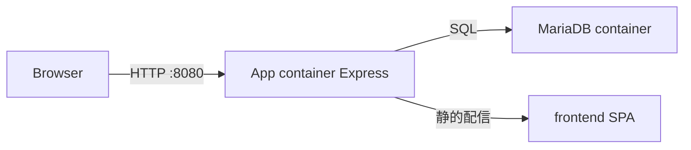

# 基盤（Docker / DB / 認証）着手計画

> 状態: **完了**  
> 概要: Docker Compose + MariaDB + Express認証API + 最小SPAシェルを実装し、ローカルで `http://localhost:8080` 相当の動作確認ができる基盤を作る。

## 範囲

今回は仕様の「1. 基盤」のみ。マスタCRUD・日報・請求は含まない。

成果物:

- ローカルで `docker compose up` → ログイン画面 → 認証付きAPIが通る状態
- 次フェーズ（企業マスタ）にすぐ載せられるDBマイグレーション基盤

根拠: [../06_development_environment.md](../06_development_environment.md)

## 技術選定（固定）

| 項目 | 採用 |
|------|------|
| ランタイム | Node.js 20 |
| API | Express |
| DB | MariaDB 10.11（Docker） |
| DBアクセス | `mysql2`（promise） |
| マイグレーション | `db/migrations/*.sql` を起動時/CLIで順適用 |
| 認証 | 簡易ID/パスワード、`bcrypt` ハッシュ |
| セッション | `express-session` + MySQLストア（Cookie、同一オリジン） |
| フロント | Vanilla HTML/CSS/JS SPA（ビルドなし） |
| 配備 | ルートの `docker-compose.yml` + 単一 `Dockerfile`（appが静的配信とAPIを同居） |

## 構成



ディレクトリ（新規）:

```text
backend/          Express API・セッション・マイグレーション実行
frontend/         login + 認証後ホーム（最小シェル）
db/migrations/    SQLマイグレーション
docker-compose.yml
Dockerfile
.env.example
README.md
```

## 実装内容

### 1. Docker / 環境

- `docker-compose.yml`: `db`（MariaDB）+ `app`（Node）
- ポート: ホスト `8080` → 容器 `3000`（本番NASと同じ）
- `.env.example`: DB接続、`SESSION_SECRET`、初期管理者 `ADMIN_LOGIN_ID` / `ADMIN_PASSWORD`、`TZ=Asia/Tokyo`
- `data/` は gitignore（mysql永続・uploads）

### 2. DBスキーマ（マイグレーション）

共通列: `created_at`, `updated_at`, `is_deleted`, `extra_data`, 楽観ロック用 `version`

- `001_users_and_sessions.sql`
  - `users`（login_id, password_hash, display_name, role 等）
  - `sessions`（express-mysql-session用）
- `002_master_tables.sql`（CRUDなし、箱だけ）
  - [../02_master_definition.md](../02_master_definition.md) と個別仕様の主要カラムに沿って
  - `companies`, `company_billings`, `company_vehicles`
  - `partners`
  - `base_projects`, `projects`, `project_revisions`
  - 区分マスタ用 `code_masters`（締日など）

起動時に未適用マイグレーションを適用し、管理者が0件なら初期管理者を1名シード。

### 3. 認証API

| メソッド | パス | 内容 |
|----------|------|------|
| GET | `/api/health` | DB疎通含むヘルスチェック（認証不要） |
| POST | `/api/auth/login` | login_id + password |
| POST | `/api/auth/logout` | セッション破棄 |
| GET | `/api/auth/me` | ログイン中ユーザー |

- 未ログインの `/api/*`（health以外）は 401
- ロール判定ミドルウェア（`requireRole('admin')`）を用意

### 4. 最小フロント

- `frontend/index.html` + `css` + `js`
- 未ログイン: ログイン画面
- ログイン後: ホーム（後に機能ランチャーへ発展）
- `fetch` は Cookie 送信（`credentials: 'include'`）
- Express が `frontend/` を静的配信し、APIと同一オリジンにする

### 5. ドキュメント / 動作確認

- ルート `README.md` に起動手順（日本語）
- 確認手順:
  1. `docker compose up --build -d`
  2. `http://localhost:8080` で初期管理者ログイン
  3. `/api/health` と `/api/auth/me` が成功することを確認

## 実施タスク（完了）

- [x] docker-compose / Dockerfile / .env.example / ディレクトリ骨格
- [x] users・sessions・マスタ箱テーブルのSQLマイグレーションと適用処理
- [x] Express認証API（login/logout/me）とセッション・ロールミドルウェア
- [x] ログイン画面と認証後ホームの最小SPAシェル
- [x] README起動手順、docker composeで動作確認

## 今回やらないこと

- 企業/パートナー/案件の画面・CRUD API
- 日報・先払い・請求・支払
- PDF生成
- QNAP実機への配備作業そのもの（composeはNASでも使える形にしておく）
