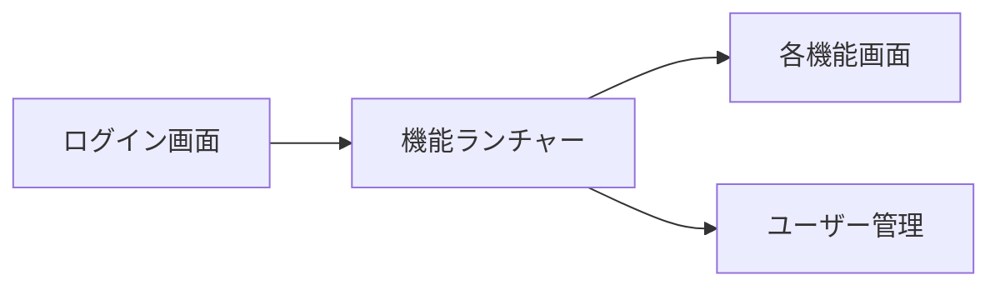

# ログイン画面イメージ先行 → 実装計画

> 状態: **完了**  
> 概要: Login.md に沿い、まずログイン画面とログイン後の機能ランチャーの見た目イメージを作成し、確認後に画面実装へ落とし込む。

## 方針

仕様は [../Login.md](../Login.md) を正とする。  
**先に見た目イメージ（モック画像）を2枚作成**し、合意後に `frontend/` へ実装する。

対象画面:

1. **ログイン画面** … ID / パスワード / ログインボタンのみ（機能ボタンは出さない）
2. **ログイン後ホーム（機能ランチャー）** … 権限のある機能だけ大きいボタンで並べ、「やりたいこと」がすぐ押せる

## ステップ1: イメージ作成

次の2枚のモック画像を生成し、レビュー用に提示する。

保管先: `docs/mockups/mock-login.png` / `docs/mockups/mock-launcher.png`

### A. ログイン画面

- ブランド名 `Links-System` を大きく
- 短い案内文
- ログインID / パスワード / ログインボタン
- 運送業務向けの落ち着いた緑系トーン
- カード過多・紫グラデ・情報過多を避ける
- **写真背景は不要**（後続フィードバックで確定）

### B. 機能ランチャー（ログイン後）

権限のある機能だけ表示する前提のレイアウト案。

| グループ | ボタン |
|----------|--------|
| マスタ | 企業 / パートナー / 案件 |
| 日々の運用 | 日報 |
| 精算 | 先払い / 請求 / 支払 |
| 設定 | ユーザー管理 |

- 上部: ユーザー名・権限・ログアウト
- 中央: グループ見出し + 大きな機能ボタン（ラベル＋短い説明1行）
- 権限のない機能は非表示
- 検索バーはMVPでは入れない（ボタン配置で探す）

## ステップ2: 画面実装

変更ファイル:

- `frontend/index.html`
- `frontend/css/styles.css`
- `frontend/js/app.js`

実装内容:

- ログイン画面をモックに合わせて作り直す
- ホームを「機能ランチャー」に変更（`can(feature)` で表示制御）
- 未実装機能ボタンは「準備中」トースト/メッセージ
- ユーザー管理は既存画面へ遷移
- 仕様メモを [../Login.md](../Login.md) に「画面構成」節として追記

## ステップ3: 確認

- 管理者ログイン → 全ボタン表示
- 営業/パートナーなど権限差でボタン数が変わること
- モバイル幅でもボタンが押しやすいこと

## 実施タスク（完了）

- [x] ログイン画面と機能ランチャーのモック画像を作成して提示
- [x] フィードバックを反映してイメージを確定（写真背景なし）
- [x] 合意イメージに合わせて frontend のログイン／ランチャーを実装
- [x] Login.md に画面構成を追記し動作確認

## 今回やらないこと

- 各業務画面（企業マスタ等）の本体実装
- 機能内検索・お気に入り
- ロゴ画像の本制作（テキストブランドで可）
