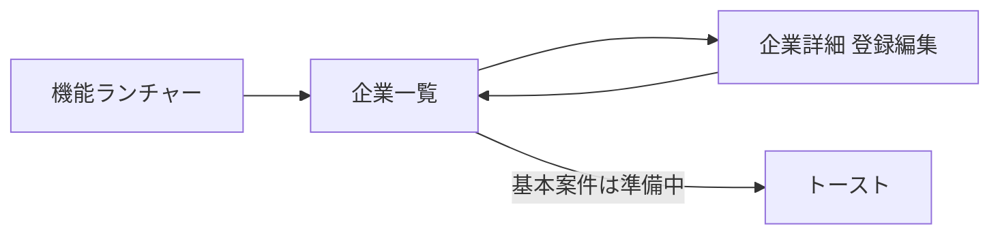

# 企業マスタ画面 実装計画

> 状態: **仮組着手**  
> 進め方: [00_仮組先行の進め方.md](00_仮組先行の進め方.md) に従う（仮組 → 見直し → 本作成）  
> 概要: 仕様書1-1と既存基盤に沿い、企業一覧・詳細（請求先・車両の1対多）を動く状態で仮組し、確認後に本作成する。

## 前提（仕様の読み替え）

正式画面仕様: [../個別機能仕様書：1-1. 企業マスタ管理画面.md](../個別機能仕様書：1-1.%20企業マスタ管理画面.md)  
実行基盤: [../06_development_environment.md](../06_development_environment.md) / 権限: [../Login.md](../Login.md)

| 仕様書の表記 | 今回の実装 |
|--------------|------------|
| IndexedDB保存 | `/api/companies` → MariaDB（既存テーブル利用） |
| SPA 2画面切替 | 一覧 ↔ 詳細をJS切替（既存シェル内） |
| 権限 | `companies`（admin / system / soumu） |

DB箱は既にある: `db/migrations/002_master_tables.sql` の `companies` / `company_billings` / `company_vehicles` / `code_masters`

## 段階

| 段階 | 内容 | 状態 |
|------|------|------|
| **仮組** | 機能一式（一覧・詳細、請求先・車両、検索/フィルタ/削除）。DBとAPIで実データ保存。連携キー確認。画面デザインは大枠。基本案件は準備中 | 完了（見直し待ち） |
| **見直し** | 項目・キー・画面セクションを実操作結果で再検討 | 未着手 |
| **本作成** | 見直し反映、UI仕上げ、バリデーション／楽観ロック等の完成度向上 | 未着手 |

## 画面構成

### 一覧

- 企業名の部分一致検索
- 締日フィルタ（`closing_date_code`）
- ソート（企業No / 企業名 / 締日）
- 表示列: 企業No, 企業名, 締日, 請求書送付方法
- 行操作: 編集 / 削除（論理削除・確認ダイアログ） / 基本案件（準備中トースト）

### 詳細（セクション分割）

1. 基本情報・銀行情報
2. 請求先（＋追加で動的行）
3. 車両（＋追加で動的行）
- 保存（必須: `company_name`）/ 一覧へ戻る
- 楽観ロック: `version`（仮組でも持たせる）

区分マスタ:

- 締日 / 支払日（既存）
- 口座種別 `deposit_type`
- 請求書送付方法 `invoice_send_method`（メール / 郵送 / 手渡し 等）

## 実装方針（仮組）

### Backend

- `backend/src/routes/companies.js`
- `backend/src/routes/masters.js`（区分コード取得）
- `server.js` にマウント
- `requireAuth` + `requirePermission('companies')`

| メソッド | パス | 内容 |
|----------|------|------|
| GET | `/api/companies` | 一覧（q / closing_date_code / sort） |
| GET | `/api/companies/:id` | 詳細＋請求先＋車両 |
| POST | `/api/companies` | 新規（ヘッダ＋子を1トランザクション） |
| PUT | `/api/companies/:id` | 更新（子配列で同期） |
| DELETE | `/api/companies/:id` | 論理削除 |
| GET | `/api/masters/codes` | 区分選択肢 |

### Frontend

- `frontend/js/companies.js`
- `app.js` の `openFeature('companies')` から呼ぶ
- スタイルは大枠（本作成で磨く）

## 仮組タスク

- [x] 区分マスタ不足分のシード（`005_company_code_masters.sql`）
- [x] 企業API（CRUD・子テーブル同期）
- [x] 企業一覧・詳細UIとランチャー接続
- [ ] 実操作でCRUD・連携キーを確認

## 今回やらないこと（仮組時点）

- 基本案件画面への実遷移
- 見た目の最終調整
- パートナー／案件マスタ本体
- PDF・帳票
