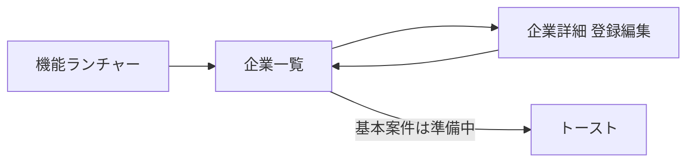

# 企業マスタ画面 実装計画

> 状態: **未着手**  
> 概要: 仕様書1-1と既存基盤（MariaDB/API/権限）に沿い、企業一覧・詳細（請求先・車両の1対多）をCRUDできる企業マスタ画面を実装する。

## 前提（仕様の読み替え）

正式画面仕様: [../個別機能仕様書：1-1. 企業マスタ管理画面.md](../個別機能仕様書：1-1.%20企業マスタ管理画面.md)  
実行基盤: [../06_development_environment.md](../06_development_environment.md) / 権限: [../Login.md](../Login.md)

| 仕様書の表記 | 今回の実装 |
|--------------|------------|
| IndexedDB保存 | `/api/companies` → MariaDB（既存テーブル利用） |
| SPA 2画面切替 | 一覧 ↔ 詳細をJS切替（既存シェル内） |
| 権限 | `companies`（admin / system / soumu） |

DB箱は既にある: `db/migrations/002_master_tables.sql` の `companies` / `company_billings` / `company_vehicles` / `code_masters`

## 画面構成

### 一覧

- 企業名の部分一致検索
- 締日フィルタ（`closing_date_code`）
- ソート（企業No / 企業名 / 締日）
- 表示列: 企業No, 企業名, 締日, 請求書送付方法
- 行操作: 編集 / 削除（論理削除・確認ダイアログ） / 基本案件（今回は「準備中」トースト。案件画面未実装のため）

### 詳細（セクション分割）

1. 基本情報・銀行情報
2. 請求先（＋追加で動的行）
3. 車両（＋追加で動的行）
- 保存（必須: `company_name`）/ 一覧へ戻る
- 楽観ロック: `version`

区分マスタ（既存シード＋不足分を追加）:

- 締日 / 支払日（既存）
- 口座種別 `deposit_type`
- 請求書送付方法 `invoice_send_method`（メール / 郵送 / 手渡し 等）

## 実装方針

### Backend

- 新規 `backend/src/routes/companies.js`
- `backend/src/server.js` に `app.use('/api/companies', ...)` を追加
- 全エンドポイントに `requireAuth` + `requirePermission('companies')`

| メソッド | パス | 内容 |
|----------|------|------|
| GET | `/api/companies` | 一覧（q / closing_date_code / sort） |
| GET | `/api/companies/:id` | 詳細＋請求先＋車両 |
| POST | `/api/companies` | 新規（ヘッダ＋子を1トランザクション） |
| PUT | `/api/companies/:id` | 更新（子は差分置換: 送った配列で同期） |
| DELETE | `/api/companies/:id` | 論理削除 |
| GET | `/api/masters/codes?category=` | 区分選択肢 |

保存時: 親 `companies` と子 `company_billings` / `company_vehicles` を同一トランザクションで処理。子は「論理削除＋新規/更新」で同期する。

### Frontend

- 新規 `frontend/js/companies.js`（一覧・詳細UI）
- `frontend/js/app.js` の `openFeature('companies')` から呼ぶ
- `frontend/css/styles.css` に一覧テーブル・フォーム・動的行のスタイル追加
- 既存ヘッダー（戻る＝ランチャー、ログアウト）を流用

### 仕様MD更新

- 個別仕様1-1に「IndexedDB → API/MariaDB」の注記を追記
- [../05_decision_log.md](../05_decision_log.md) に企業マスタ着手を記録

## 実施タスク

- [ ] 企業API（CRUD・子テーブル同期・区分マスタ）を追加
- [ ] 企業一覧・詳細画面UIを実装しランチャーから接続
- [ ] 仕様MDを更新し、権限差・CRUDを動作確認

## 確認項目

- `companies` 権限ありでCRUD可能
- 権限なしで403 / ランチャー非表示
- 請求先・車両の追加・削除が保存後も保持
- 同時更新で version 不一致時にエラー表示

## 今回やらないこと

- 基本案件画面への実遷移
- パートナー／案件マスタ本体
- PDF・帳票
