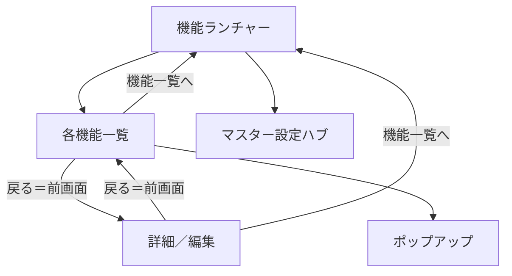

# 機能追加仕様（画面差分取り込み）

> 状態: **仮組完了（見直し待ち）**  
> 作成日: 2026-07-31  
> 仮組実施: 2026-07-31  
> 根拠: [05_画面差分_要不要チェック.md](05_画面差分_要不要チェック.md) の記入結果  
> 参照画像: [`仕様MD/画面一覧/`](../画面一覧/)  
> 進め方: [00_仮組先行の進め方.md](00_仮組先行の進め方.md)（仮組 → 見直し → 本作成）  
> 実装: マイグレーション `007_feature_additions_draft.sql` ほか API／画面の仮組済み

## 1. スコープ判定

| 判定 | 内容 |
|------|------|
| **要（本仕様に含む）** | A-04〜A-11、B-01〜B-06、C-01〜C-04、D-01〜D-06、E-01〜E-03、F-01〜F-08、G-01〜G-08、H-01〜H-04、I-01〜I-06、K-06〜K-08 |
| **不要** | A-01（サイドバー型ナビへの移行）→ **機能ランチャー型を維持** |
| **保留（本仕様に含めない）** | A-02 ダークテーマ、A-03 ダッシュボード、H-05 旬払い、J-01 貸付分割支払、K-01〜K-05 収支／総振／消込／分析／Excel |

### 記入メモによる読み替え

| ID | 読み替え |
|----|----------|
| **G-07** | 「作り直しに再承認」ではない。**請求確定の解除**により、請求データを再度変更可能にする |
| **G-08** | 帳票プレビュー中心で一度作るが、**後日変更の可能性あり** |
| **K-06** | 要＋保留の二重チェックだったため、K-07/K-08が要であることから **要に正規化** |

## 2. 全体方針

- ナビは **ランチャー維持**（A-01 不要）
- 各画面上部に **機能一覧（メニュー）へ戻る**（A-10）
- 画面内の **戻る＝ひとつ前の画面**（A-11）
- 一覧共通: ヘッダー sticky・行高を狭く・列ソート・列インラインフィルタ・表示列マスター（A-04〜A-08）
- UIビルダー（A-09）も要として含める（表示マスターより高機能なレイアウト編集）

## 3. 共通UI（A）

### 3.1 一覧コンポーネント共通要件

| ID | 要件 |
|----|------|
| A-04 | `thead` などヘッダー行を縦スクロール時も固定 |
| A-05 | 行の高さを仮組より狭くする |
| A-06 | 列ヘッダークリック等でソート可 |
| A-07 | 列直下（または同等）のインラインフィルタ |
| A-08 | 画面表示マスター: 表示列・順番の変更（ユーザー単位を基本。未設定時は機能デフォルト） |

### 3.2 ナビ

| ID | 要件 |
|----|------|
| A-10 | 画面上部に「機能一覧（メニュー）へ戻る」常設 |
| A-11 | 「戻る」は履歴上のひとつ前へ |

### 3.3 UIビルダー

| ID | 要件 |
|----|------|
| A-09 | D&D等で画面レイアウトを編集できる UIビルダー（参照: `16_マスター設定_UIビルダー.png`）。詳細画面の「レイアウト変更」から到達可能 |

### DB影響（共通）

- `user_screen_layouts` 相当（user_id, screen_key, columns_json / layout_json）
- UIビルダー用に layout 定義の保存領域（上記と統合可）

## 4. 企業マスタ（B）

参照: `02_企業管理_*.png` / 個別仕様 1-1

### 画面構成

1. **一覧**: 列拡充＋共通一覧要件
2. **詳細**: 基本情報編集。請求先・車両は **一覧表**。追加／編集は **ポップアップ**
3. **担当履歴**: 期間付きの弊社担当／契約担当

### 要件

| ID | 要件 |
|----|------|
| B-01 | 一覧に企業NO・事業所・稼働形態・営業担当・基本案件数などを表示 |
| B-02 | 稼働形態・請求書送付先住所・FAX 等を項目に含める |
| B-03 | 請求先は詳細内一覧＋ポップアップ CRUD |
| B-04 | 車両も請求先と同じ操作パターン |
| B-05 | 弊社担当者・弊社契約担当者はコンボ（マスター参照＋手入力可） |
| B-06 | 担当を期間付き履歴管理（開始日〜・種別・氏名／ユーザー） |

### DB影響

- `companies` への列追加（稼働形態、FAX 等。不足分）
- `company_manager_periods`（仮）: company_id, role_type, name_or_user_id, start_date, end_date
- 請求先・車両は既存子テーブルを流用し、UIのみポップアップ化

## 5. パートナーマスタ（C）

参照: `03_パートナー管理_*.png` / 個別仕様 1-2

| ID | 要件 |
|----|------|
| C-01 | 一覧に銀行・稼働開始・継続年数・免許期限・保険バッジ・案件数 |
| C-02 | 血液型・生年月日などを項目に含める |
| C-03 | 一覧に「案件一覧」ボタン → 個別案件を partner_id フィルタで開く |
| C-04 | 車両は詳細で1対多（UIは一覧＋ポップアップ等、企業と同パターン推奨） |

### DB影響

- `partners` への列追加（blood_type, birth_date, work_start_date 等）
- 案件数は集計表示で可

## 6. 基本案件／個別案件（D）

参照: `04_基本案件管理_*.png` / `05_案件管理_*.png`

| ID | 要件 |
|----|------|
| D-01 | 基本案件と個別案件を **別機能（別メニュー／別機能キー）** に分離 |
| D-02 | 基本案件一覧から「案件作成」で個別案件を起こす |
| D-03 | 個別新規で基本案件テンプレート選択 → 初期値コピー |
| D-04 | 基本案件にも個別と **同じ項目セット** を持たせる |
| D-05 | 稼働形態・日報カウント区分・残業計算区分・開始／終了時間・休憩を含める |
| D-06 | 案件区分の金額について、区分がなくても必要な金額項目を画面表示 |

### 権限

- `Login.md` に `base_projects`（仮）を追加し、`projects` と権限を整理（admin / system / soumu / sales 想定）

### DB影響

- `base_projects` の列拡張（個別と同水準）
- 機能キー分離に伴う permissions 更新

## 7. 金額データ管理（E）— 新機能

参照: `06_金額データ管理_*.png`

| ID | 要件 |
|----|------|
| E-01 | 金額データ管理を独立機能として追加 |
| E-02 | 金額は案件埋め込み改定ではなく **金額マスタ参照を主** とする |
| E-03 | 料金行に曜日・計算区分・請求／支払ペア単価・利益率表示 |

### 画面

- 一覧／新規／詳細（料金行グリッド、他からコピー、行追加）
- 連携先: 基本案件・個別案件

### DB影響

- `price_sets` / `price_set_lines` 相当（適用期間、連携先、曜日、種別、求・払単価）
- 既存 `project_revisions` は移行または参照ラッパ（実装時に見直し）

## 8. 日報（F）

参照: `07_日報管理_*.png` / 個別仕様 2-1

### 画面構成

1. **一覧（対象月・案件行）**: 前月／次月、対象稼働案件数、入力完了率、入力状況、ステータス、「入力」
2. **入力（勤怠グリッド）**: 日付1行。サマリーヘッダー。行展開で深夜・スポット・金額訂正
3. アクション: 金額確認、一括表示、承認依頼、保存、戻る

| ID | 要件 |
|----|------|
| F-01 | 一覧を対象月の案件行ベース（入力状況・完了率） |
| F-02 | 前月／次月ボタン |
| F-03 | 勤怠グリッド（日付1行） |
| F-04 | 不参／研修、拘束・稼働・超過・不足、距離系 |
| F-05 | 通行料・駐車料・交通費などの経費列 |
| F-06 | 行展開: 深夜・スポット加算・金額訂正・行コメント |
| F-07 | 金額確認／一括表示／承認依頼 |
| F-08 | ヘッダーサマリー（稼働日数・超過／不足・総距離等） |

### DB影響

- `daily_reports` を「案件×日」行モデルに寄せる、またはヘッダ＋明細テーブル分割
- 日次列の追加（flags, hours breakdown, distance, expenses columns）

## 9. 請求（G）

参照: `08_請求管理_*.png` / 個別仕様 3-2

### 画面構成

1. **月次TODO一覧**: 完了率、日報状態、請求作成、リスト除外
2. **作成／編集**: 日報から集計ルール適用、明細編集、日報外金額追加
3. **詳細**: 帳票プレビュー中心、仮／本、PDF、印刷済

| ID | 要件 |
|----|------|
| G-01 | 月次TODO一覧 → 編集／作成 |
| G-02 | 日報確定／承認状況に応じた作成可否表示 |
| G-03 | リストから除外（請求不要） |
| G-04 | 集計ルールで明細生成＋金額編集＋日報外金額 |
| G-05 | 仮請求書は承認前発行可、本請求書は承認後のみ |
| G-06 | PDF出力で印刷済みフラグ |
| G-07 | **請求確定解除**により再編集可能（再発行再承認ではない） |
| G-08 | 帳票プレビュー中心（後日変更の可能性あり） |

### 承認・状態（案）

- 下書き／承認待ち／承認済（本発行可）／確定
- `printed` フラグ（PDF時）
- 確定解除 → 編集可（権限付き）

### DB影響

- invoices に承認・確定・印刷フラグ、除外リスト
- invoice_details の拡充、日報リンク維持

## 10. 支払（H）

参照: `09_支払管理_*.png` / 個別仕様 3-3

請求の裏返し（同構成）。

| ID | 要件 |
|----|------|
| H-01 | 一覧TODO → 編集／詳細（帳票） |
| H-02 | 仮支払書は承認前可、本支払書は承認後のみ |
| H-03 | PDFで印刷済みフラグ |
| H-04 | 先払い・振込手数料・定額控除の自動反映 |

※ H-05 旬払いは保留（本仕様外）

## 11. 先払（I）

参照: `10_先払管理_*.png` / 個別仕様 3-1

| ID | 要件 |
|----|------|
| I-01 | 対象月の再計算・生成で一括作成／更新 |
| I-02 | 単価・日数変更で総額を即再計算 |
| I-03 | 日数手入力（小数第1位） |
| I-04 | スピン上下は基本1刻み |
| I-05 | 入力前タイトル付きで対象／単価／日数／手数料／合計を見やすく |
| I-06 | 手動前払い申請ルート（稼働計算と別）も採用 |

### DB影響

- advance_payments の日数手入力・即時計算対応
- 手動申請用レコード種別または別テーブル

## 12. マスター設定（K）

参照: `16_マスター設定_*.png`

| ID | 要件 |
|----|------|
| K-06 | マスター設定ハブ（共通小口マスタへの入口カード群） |
| K-07 | 営業担当者マスタ CRUD |
| K-08 | 料金種別・残業計算区分・システムデフォルト値マスタ |

※ K-01〜K-05 は保留（本仕様外）

### DB影響

- `staff_masters`（営業担当）等
- code_masters カテゴリ拡充、system_settings キーバリュー

## 13. 実装優先度（目安）

コード着手時の推奨順（仮組→見直し→本作成は各塊で適用）:

1. **共通一覧・ナビ（A-04〜A-08, A-10, A-11）**
2. **企業・パートナー（B, C）**
3. **案件分離・金額マスタ（D, E）**
4. **日報勤怠グリッド（F）**
5. **請求・支払・先払（G, H, I）**
6. **マスター設定・UIビルダー（K, A-09）**

## 14. 関連ドキュメントの扱い

- 個別機能仕様書は、実装着手時に本ファイルを正として読み替え／追記する
- 本ファイルが機能追加の **取り込み結果の正** である
- チェック原簿は [05_画面差分_要不要チェック.md](05_画面差分_要不要チェック.md)
