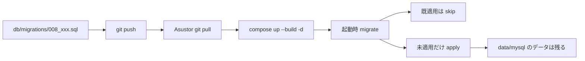

# Asustor テストNAS：ソース更新・DB更新手順

> 状態: **適用中**  
> 対象: **ASUSTOR AS3202T**（テスト環境）上の Links-System  
> 前提: [07_AsustorテストNAS配備手順.md](07_AsustorテストNAS配備手順.md) で初回配備済み  
> 作業ディレクトリ例: `/volume1/docker/Links-System`  
> アクセス: `http://<AsustorのIP>:8080`

## 0. この文書の目的

初回配備のあと、次の2つが起きたときに **何を実行するか** を定める。

1. **ソース更新** … 画面・API・設定のコードが変わった  
2. **データベース更新** … `db/migrations/*.sql` が追加・変更された（スキーマ／シード）

```text
開発（Cursor）で変更・push
        │
        ▼
Asustor で git pull → docker compose up --build -d
        │
        ▼
起動時に未適用マイグレーションだけ自動適用
（data/mysql の業務データは原則残る）
```

## 1. 早見表

| 変更内容 | Asustor でやること |
|----------|-------------------|
| 画面・API・CSS などコードのみ | §2 ソース更新 |
| `db/migrations/` に新SQL追加 | §2 と同じ（起動時に自動適用）→ §3 でログ確認 |
| `.env` だけ変更 | `docker compose up -d`（再ビルド不要なことが多い） |
| 大きな変更の前に備えたい | §4 バックアップ |
| データをバックアップから戻す | §5 リストア |
| 空からやり直す（全データ削除） | §6 初期化（最終手段） |

**日常運用では §2 だけで足りる。**

## 2. ソース更新（通常手順）

SSH で Asustor に入り、リポジトリへ移動する。

**ワンコマンド（推奨）:**

```bash
cd /volume1/docker/Links-System
./scripts/nas-sync.sh --backup   # バックアップしてから同期
# またはバックアップ省略: ./scripts/nas-sync.sh
```

手動で行う場合:

```bash
cd /volume1/docker/Links-System

# 反映したい版を取得（main にマージ済みなら main）
git fetch
git checkout main
git pull

# アプリを再ビルド・再起動
docker compose up --build -d

# 起動ログを確認
docker compose logs app --tail 50
```

### 2.1 ログの見方

| ログ | 意味 |
|------|------|
| `[migrate] skip: 00x_….sql` | そのファイルは既に適用済み（正常） |
| `[migrate] apply: …` → `done:` | **新しいDB変更**が今回適用された |
| `[boot] Links-System listening on :3000` | アプリ起動成功 |
| `[migrate] failed` / 起動直後に落ちる | §7 トラブル |

### 2.2 ブラウザ確認

1. `http://<AsustorのIP>:8080` を開く  
2. 可能ならスーパーリロード（キャッシュ破棄）  
3. `/api/health` で `db: "up"`  
4. 変更した画面を操作して確認  

### 2.3 やってはいけないこと

- 普段の更新で `data/mysql` を削除する  
- 普段の更新で `docker compose down -v`（Volume削除）を使う  
- 本番QNAPと同じ `.env` パスワードのまま使い続ける（テスト用は別値）  

## 3. データベース更新の仕組み

DB構造の変更は **手で SQL を打たない**。次の流れが正である。

1. 開発側で `db/migrations/008_何かの説明.sql` を追加して git に載せる  
2. Asustor で §2（`git pull` → `compose up --build -d`）を実行  
3. `app` 起動時に [`backend/src/migrate.js`](../../backend/src/migrate.js) が  
   - `schema_migrations` を見て  
   - **未適用の `.sql` だけ** を順番に実行する  



### 3.1 適用済み一覧の確認（任意）

```bash
cd /volume1/docker/Links-System
# .env の MYSQL_PASSWORD / MYSQL_USER / MYSQL_DATABASE を使う
docker compose exec -T db \
  mysql -ulinks -p"${MYSQL_PASSWORD:-links_pass_change_me}" links_system \
  -e "SELECT filename, applied_at FROM schema_migrations ORDER BY filename;"
```

パスワードがコンテナ環境と違う場合は `.env` の値に合わせて `-p` を変える。

### 3.2 注意

- 一度 `done` になったファイルは **同じファイル名では再実行されない**  
- 誤りを直すときは、原則 **新しい番号のSQLを追加** する（既適用ファイルの書き換えは避ける）  
- マイグレーション失敗時はコンテナが起動に失敗することがある → ログを見て §7  

## 4. バックアップ（更新前推奨）

大きなソース／DB更新の前に取得する。

```bash
cd /volume1/docker/Links-System
mkdir -p backups
# .env を読み込んでパスワードを使う例
set -a && source .env && set +a

docker compose exec -T db \
  mysqldump -u"${MYSQL_USER:-links}" -p"${MYSQL_PASSWORD}" \
  --single-transaction --routines --triggers \
  "${MYSQL_DATABASE:-links_system}" \
  > "backups/links_${MYSQL_DATABASE:-links_system}_$(date +%Y%m%d_%H%M%S).sql"

ls -lh backups | tail
```

- バックアップファイルは NAS 上の `backups/` に残る（git にコミットしない）  
- 取得後に §2 の更新を実行する  

## 5. リストア（バックアップから戻す）

**上書きになる。** 戻す前に、可能なら現状の別バックアップを取る。

```bash
cd /volume1/docker/Links-System
set -a && source .env && set +a

# 例: 戻したいファイルを指定
RESTORE_FILE=backups/links_links_system_20260801_120000.sql

docker compose exec -T db \
  mysql -u"${MYSQL_USER:-links}" -p"${MYSQL_PASSWORD}" \
  "${MYSQL_DATABASE:-links_system}" \
  < "$RESTORE_FILE"

docker compose restart app
docker compose logs app --tail 30
```

リストア後も `schema_migrations` の内容はバックアップ時点のものになる。  
その後に **新しい** マイグレーションをまた適用したい場合は、§2 で `app` を再起動すれば未適用分だけ走る。

## 6. 完全初期化（最終手段）

試験データを捨てて、空のDBからやり直すときだけ。

```bash
cd /volume1/docker/Links-System

# 1) 必要なら §4 でバックアップ
# 2) 停止
docker compose down

# 3) DBデータ削除（業務データが消える）
# パスは環境により異なる。リポジトリ直下の data/mysql を想定
rm -rf data/mysql

# 4) 再作成・起動（マイグレーションが最初から走り、管理者が再シードされる）
docker compose up --build -d
docker compose logs app --tail 50
```

- `.env` の `ADMIN_*` で初期管理者が再作成される（users が空のとき）  
- `uploads` / `pdf` は必要に応じて別途整理  

## 7. トラブルシュート

| 症状 | 確認・対処 |
|------|------------|
| 画面が古い | スーパーリロード。`git log -1` で想定コミットか確認 |
| `git pull` 失敗 | 認証・ネット。ローカル変更があるなら `git status` |
| ビルド失敗・落ちる | メモリ2GB不足の可能性。他アプリ停止後に再実行（07 §12） |
| migrate failed | `docker compose logs app` のSQLエラーを確認。バックアップから戻すか、開発側で修正SQLを追加 |
| DB接続エラー | `docker compose ps`、`logs db`、`.env` の `DB_*` / `MYSQL_*` |
| ログインできない | 初期化後は `.env` の ADMIN。パスワード変更済みならその値 |

## 8. `.env` だけ変えたとき

```bash
cd /volume1/docker/Links-System
# .env を編集したあと
docker compose up -d
# DBパスワードなど db 容器の環境を変えた場合は再作成が必要になることがある
# docker compose up -d --force-recreate
```

`MYSQL_PASSWORD` を **既存データ作成後に変える** と不整合になりやすい。  
変える場合は手順を分けて実施する（必要なら別途依頼）。

## 9. 開発側（参考）：マイグレーションを足すとき

Asustor 作業ではないが、流れの理解用。

1. `db/migrations/` に `008_説明.sql` を追加（番号は既存の次）  
2. ローカルで `docker compose up --build -d` し `apply/done` を確認  
3. git にコミット・push（`main` へマージ）  
4. Asustor で本手順 §2 を実行  

## 10. 関連

| 文書 | 内容 |
|------|------|
| [07_AsustorテストNAS配備手順.md](07_AsustorテストNAS配備手順.md) | 初回配備（画面クリック順） |
| [`06_development_environment.md`](../06_development_environment.md) | 開発・NAS基盤仕様 |
| [`backend/src/migrate.js`](../../backend/src/migrate.js) | 自動マイグレーション実装 |

---

## 決定メモ

* テストNASの通常更新は **git pull + compose up --build**  
* DB変更は **migrations 自動適用**（手打ちSQLは常用しない）  
* `data/mysql` 削除は初期化時のみ  
* 重要更新の前は **mysqldump バックアップ** を推奨  
