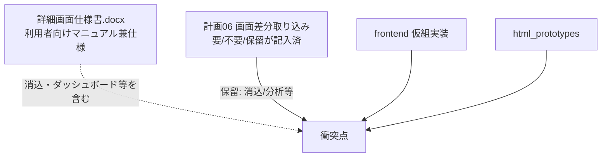

# 詳細仕様書との差分整理（日報・請求・支払）

> 状態: **合意反映済（Q7・Q9のみ再確認待ち）／プロト修正着手可**  
> 作成: 2026-08-17／合意追記: 2026-08-17  
> 根拠ドキュメント:
> - 受領: `仕様MD/外部受領/LinksSys_詳細画面仕様書.docx`
> - リポジトリ: `仕様MD/計画/06_機能追加仕様_画面差分取り込み.md`（F/G/H）
> - 現行仮組: `frontend/js/daily_reports.js` / `invoices.js` / `payments.js`
> - プロト: `html_prototypes/08`〜`10`

## 0. 合意サマリー（2026-08-17 回答）

### 4.1 日報

| 項目 | 合意 |
|------|------|
| 単位 | **案件×月** |
| 月移動 | **前月／次月／月直接指定**（現行どおり） |
| ステータス | 詳細仕様書の状態を **バッジ表示**（入力中／承認待ち／承認済／差戻し／**訂正中** 等） |

### 4.2 請求

| 項目 | 合意 |
|------|------|
| 消込UI | **プロトから不要**（FB系で後日対応） |
| 月指定 | 日報と同じ（前月／次月／直接指定） |
| 詳細修正 | **可**。イメージは「日報の請求情報を取り込み → そのデータを修正」 |
| 手動追加 | 日報に無い行の **新規追加可** |
| 再取り込み | **要検討**（上書き／差分／手修正保護など未決） |

### 4.3 支払

| 項目 | 合意 |
|------|------|
| 月指定 | 日報と同じ |
| 詳細修正 | **可**。イメージは「日報の**支払**情報を取り込み → 修正」（※回答文は「請求情報」だが支払章のため支払側と解釈。違えば訂正ください） |
| 手動追加 | 日報に無い行の新規追加可 |
| 再取り込み | **要検討** |

### Q一覧

| ID | 回答 | メモ |
|----|------|------|
| Q1 消込 | **FBで対応**（今回プロト／本作成に入れない） | |
| Q2 支払詳細編集 | **推奨どおり**（控除カード＋明細参照、確定前編集） | |
| Q3 日報単位 | **(a) 案件×月** | |
| Q4 請求・支払に前月次月 | **付ける** | |
| Q5 プロト月UIを現行に合わせる | **合わせる** | |
| Q6 承認取消→訂正中 | **入れる** | |
| Q7 無効化 vs 確定解除 | **再説明待ち**（下記 §0.1） | |
| Q8 支払済ステータス | **入れる** | |
| Q9 消込 vs 保留の衝突 | **再説明待ち**（下記 §0.2）／実務上は Q1 で消込＝後日 | |
| Q10 ダッシュボード | **後日対応** | |
| Q11 手順 | **プロト修正 → 問題解消後に仕様MD反映** | |

### 0.1 Q7 の再説明（確認お願い）

詳細仕様書と計画06／現行に、**似て非なる2操作**があります。

| 操作 | 出典 | 意味（要約） |
|------|------|----------------|
| **確定解除** | 計画06 G-07・現行 `unconfirm` | いったん「確定」した請求を解き、**同じ請求データを再編集**できるようにする |
| **請求書無効化** | 詳細仕様書第8章 | 発行済み請求を **破棄（無効）** し、作り直し前提にするイメージ |

**聞きたいこと:**  
(A) **確定解除だけ**でよい（無効化は作らない）  
(B) **無効化だけ**でよい  
(C) **両方**必要（役割が違う）  
(D) 無効化＝確定解除の言い換えで、画面上は1つに統合  

### 0.2 Q9 の再説明（確認お願い）

Q9は「仕様ソースの衝突」の話です（実装機能の話ではありません）。

- 詳細仕様書 **第8章タイトル／画面イメージ**＝入金消込が中心  
- 計画06では入金消込は **保留（K）**  
- ご回答 Q1＝消込は FB で後日  

**聞きたいこと:**  
Q9は実質「今回の正は計画06＋Q1（消込は後）」でよいかの確認です。  
→ **はい**なら「衝突は解消（消込＝後日／FB）」と記録します。

---

## 0b. 今回の方針（ユーザー指示・先に固定）

| # | 方針 | 扱い |
|---|------|------|
| 1 | **月移動の仕組みは現行システムを生かす** | 日報・請求・支払で `target_year_month` ＋前月／次月／直接指定 |
| 2 | **請求・支払の詳細でデータ修正できる仕様を生かす** | 取込→修正＋手動行追加。再取込ルールは未決 |
| 3 | 詳細仕様書を踏まえて訂正 | **プロト先行（Q11）** → 問題解消後に仕様MD |

---

## 1. 仕様の「正」が複数ある問題（最重要）

| ソース | 性格 | 日報・請求・支払での位置づけ |
|--------|------|------------------------------|
| **計画06** | ヒアリング後の取り込み結果の正（要／不要／保留） | F/G/H は **要**。入金消込・収支分析は **保留（K）** |
| **詳細仕様書.docx** | 画面イメージ付きの説明書 | 第7〜9章。請求章は **入金消込が主眼** |
| **frontend 仮組** | いま動く実装 | 月次＋簡易ワークフロー。PDF・本計算は薄い |
| **html_prototypes** | UI案 | 企業周りは更新済。08〜10は **まだ旧構成寄り** |

**合意が必要な前提:**  
訂正の「正」をどれにするか。提案は次のとおり。

1. **画面フロー・必須機能の範囲** → 計画06（要／保留）を優先  
2. **項目名・操作の説明・将来像** → 詳細仕様書を参照し、計画06に無いが要なら追記  
3. **月移動・詳細での修正** → **現行 frontend の挙動を残す**（今回の明示指示）  
4. **見た目の仮作成** → `html_prototypes` を先に直し、合意後に frontend  

---

## 2. 現行 frontend の事実（生かす対象）

### 2.1 日報（`daily_reports.js`）

- **月移動あり**: `← 前月` / `<input type="month">` / `次月 →`（`shiftMonth`）
- 一覧: **対象月 × 案件行**（完了率・入力状況・「入力」）
- 詳細相当: **案件の勤怠グリッド**（日付1行、戻る＝月次一覧）
- 承認系の操作あり（仮組レベル）

### 2.2 請求（`invoices.js`）

- **対象月あり**: `<input type="month">` ＋締日＋「表示」（前月／次月ボタンは日報ほど明示的ではない）
- 一覧: 月次TODO（締め対象）＋発行済み
- **詳細で修正可**: 確定前は明細（名称・単価・数量・金額）・調整額・仮/本を編集し「明細保存」
- 確定後はロック。**確定解除**で再編集可（G-07 と一致）

### 2.3 支払（`payments.js`）

- **対象月あり**: 請求と同型（month ＋締日＋表示）
- 一覧: 締め対象＋発行済み
- **詳細はプレビュー中心で明細編集UIが無い**（承認／確定解除／印刷／戻るのみ）  
  → 「詳細で修正できる仕様を生かす」指示に対し、**請求側は現状維持、支払側は不足**

---

## 3. 詳細仕様書.docx（第7〜9章）の要約

### 3.1 第7章 日報

- ヘッダ: 案件／パートナー、対象月・請求月、締め日、ステータス、入力者、承認コメント・日時
- グリッド: 日付・行番号、不要チェック、開始／終了／休憩、拘束・実働・超過・深夜・不足、距離、経費、加算、研修、計算済請求／支払、適用単価
- 行展開: スポット単価・タスク
- 操作: 行追加／削除、保存、承認申請、承認、差戻し、**承認取消（訂正中）**
- 将来: FAX OCR

### 3.2 第8章 請求・**入金消込**

- 画面イメージは **入金インポート＋未消込入金と請求のマッチング** が中心
- 請求ヘッダ／明細（手動追加フラグ、単価スナップショット等）
- 操作: 請求作成、PDF発行、明細手動追加、入金登録／インポート、自動マッチング、消込確定、請求無効化

### 3.3 第9章 支払（控除明細）

- サマリーカード: 総支給・通常控除・先払控除・振込手数料・ペナルティ／調整・差引支給
- 明細テーブル（稼働日ごと）
- 操作: 確定、支払済、PDF明細書

---

## 4. 三者比較（差分表）

### 4.1 日報

| 観点 | 詳細仕様書 | 計画06 (F) | frontend | プロト 08 |
|------|------------|------------|----------|-----------|
| 単位 | 案件×月のグリッド中心 | 月次案件一覧→グリッド | **同左** | 一覧＋詳細寄り（月フィルタはあるが前月次月UI弱い） |
| 月移動 | 対象月表示 | F-02 前月／次月 | **実装済** | month input のみ |
| グリッド項目 | 非常に詳細（深夜・スポット等） | F-03〜F-08 | 仮組で一部 | アコーディオンあり（見た目は近い） |
| ステータス | 入力中／承認待ち／承認済／差戻し／訂正中 | 承認依頼等 | draft/confirmed/approved/rejected | バッジ表示 |

**差分メモ:** プロトは「月次案件一覧→入力」の導線が弱い。月移動は frontend をプロトへ移植すべき。

### 4.2 請求

| 観点 | 詳細仕様書 | 計画06 (G) | frontend | プロト 09 |
|------|------------|------------|----------|-----------|
| 主画面 | **消込UIが主役** | **月次TODO→作成／編集→帳票** | TODO＋発行済＋詳細編集 | 発行済一覧＋詳細モーダル＋消込っぽい要素混在 |
| 月指定 | 期間・発行日 | 対象月 | month＋締日 | month フィルタ |
| 詳細修正 | 明細手動追加・無効化 | G-04 金額編集、G-07 確定解除 | **明細編集あり** | 詳細は表示中心（編集弱い） |
| 入金消込 | 章の中核 | **K系で保留** | 未実装 | 画面に消込の匂いあり |

**矛盾（要判断）:** 詳細仕様書の第8章＝消込中心 vs 計画06＝消込保留。  
**提案:** 今回の訂正範囲は **G（TODO・詳細編集・PDFフラグ）** に限定し、消込は「将来／保留」と明記。プロトから消込を前面に出さない／出すなら「保留UI」ラベル。

### 4.3 支払

| 観点 | 詳細仕様書 | 計画06 (H) | frontend | プロト 10 |
|------|------------|------------|----------|-----------|
| 構成 | 控除サマリー＋明細 | TODO→編集／詳細（請求の裏返し） | TODO＋発行済、**詳細編集なし** | 一覧＋明細詳細モーダル |
| 月指定 | 計算期間 | 対象月 | month＋締日 | month フィルタ |
| 詳細修正 | 振込手数料・ペナルティ等入力 | H で編集想定 | **不足** | 表示中心 |
| 控除 | 通常／先払／手数料 | 控除ロジック言及 | 先払控除は集計表示 | カード表示あり |

**指示との関係:** 「詳細で修正できる仕様を生かす」→ 請求は現行OK、**支払は詳細編集を仕様・プロト・実装に戻す／足す**のが訂正ポイント。

---

## 5. 不明点・矛盾点チェックリスト（合意用）

### A. 範囲・優先

| ID | 論点 | 選択肢（案） | 推奨 |
|----|------|--------------|------|
| Q1 | 請求画面の「正」 | (a) 計画06の TODO＋詳細編集 (b) 詳細仕様書の消込UI (c) 両方同時 | **(a)**。消込は保留のまま別フェーズ |
| Q2 | 支払詳細の編集項目 | (a) 請求と同型（明細行編集） (b) 詳細仕様書どおり控除カード＋調整入力 (c) 両方 | **(b)＋明細参照**。確定前のみ編集 |
| Q3 | 日報の単位 | (a) 案件×月（現行） (b) パートナー×月（仕様書の言い回し） | **(a)**。仕様書の「パートナー名」はヘッダ表示項目として両立 |

### B. 月移動

| ID | 論点 | 推奨 |
|----|------|------|
| Q4 | 請求・支払にも日報と同じ「前月／次月」ボタンを付けるか | **付ける**（月 input は残し、操作性を揃える） |
| Q5 | プロト 08〜10 の月UIを frontend に合わせるか | **合わせる**（今回の「現行の月移動を生かす」） |

### C. 状態機械

| ID | 論点 | 推奨 |
|----|------|------|
| Q6 | 日報「承認取消→訂正中」は計画06に無い。入れるか | 詳細仕様書に合わせ **入れる（仮組でステータス追加）** か、当面は却下／再申請で代替するか要確認 |
| Q7 | 請求「無効化」と「確定解除」 | 計画06は確定解除。無効化は詳細仕様書。**両方必要か**要確認 |
| Q8 | 支払「支払済」ステータス | 詳細仕様書あり。現行は印刷済・確定中心。**支払済を追加するか**要確認 |

### D. 計画06の保留との衝突

| ID | 衝突 | 推奨 |
|----|------|------|
| Q9 | 詳細仕様書第8章の消込 vs 計画06の K保留 | プロト／本作成の **今回スコープ外** と明記し、docx を仕様MDに取り込む時は「保留章」に落とす |
| Q10 | ダッシュボード（docx第2章）vs 計画06 A-03保留 | 今回スコープ外 |

### E. プロトと本実装の順序

| ID | 論点 | 推奨 |
|----|------|------|
| Q11 | 先にプロト08〜10を直すか、仕様MDだけ直すか | これまでの流れどおり **プロト合意→仮作成**。本ファイル合意後に 08→09→10 の順 |

---

## 6. 訂正時の作業パッケージ（合意後）

1. **日報プロト（08）**  
   - 月次案件一覧＋前月／次月（frontend 準拠）  
   - 入力グリッドへ遷移、「一覧へ戻る」  
   - 項目は詳細仕様書＋F-03〜F-08 を段階的に

2. **請求プロト（09）**  
   - 月移動（前月／次月）  
   - 月次TODO＋発行済み  
   - 詳細フルページで **明細編集可**（確定ロック／解除）  
   - 消込UIは出さないか「保留」明示

3. **支払プロト（10）**  
   - 月移動  
   - 詳細で控除・調整・明細の **編集可**（確定前）  
   - サマリーカードは詳細仕様書イメージを採用可

4. **仕様MD**  
   - 計画06 の G/H に「月移動は日報と同型」「詳細編集は確定前」を明記  
   - 詳細仕様書との差分（消込保留等）を decision_log に1行追記  
   - 本ファイルを更新して「合意済」にする

5. **frontend 仮作成**  
   - プロト合意後。支払詳細編集の不足を優先解消

---

## 7. 次のアクション（ユーザーへ）

以下だけ先に回答いただけると、実装に入れます。

1. **Q1** 請求の消込UIは今回やる／やらない（推奨: やらない）  
2. **Q2** 支払詳細の編集は控除カード中心でよいか  
3. **Q6〜Q8** 承認取消・請求無効化・支払済を今入れるか  
4. 訂正着手順: **08 → 09 → 10** でよいか  

合意後、プロト修正→仕様MD追記→（その後）frontend の順で進めます。
